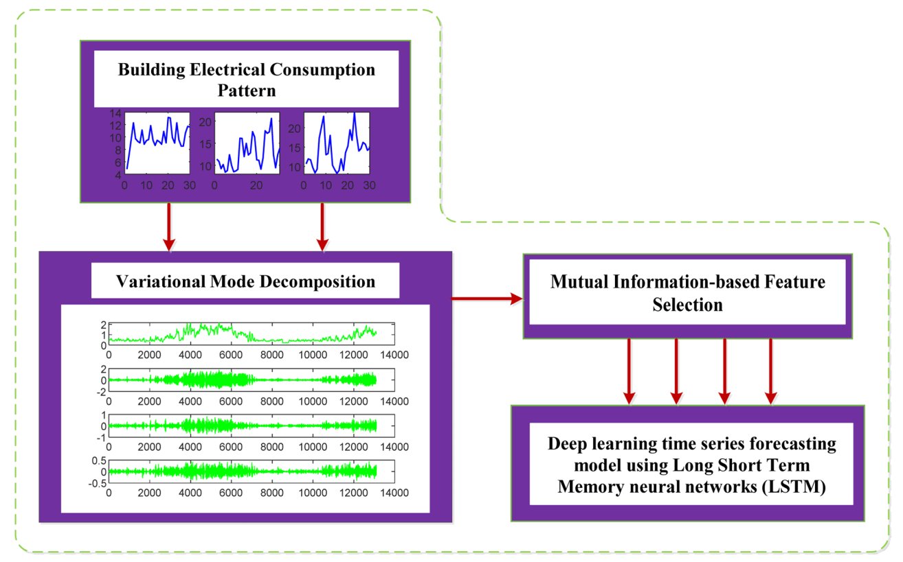
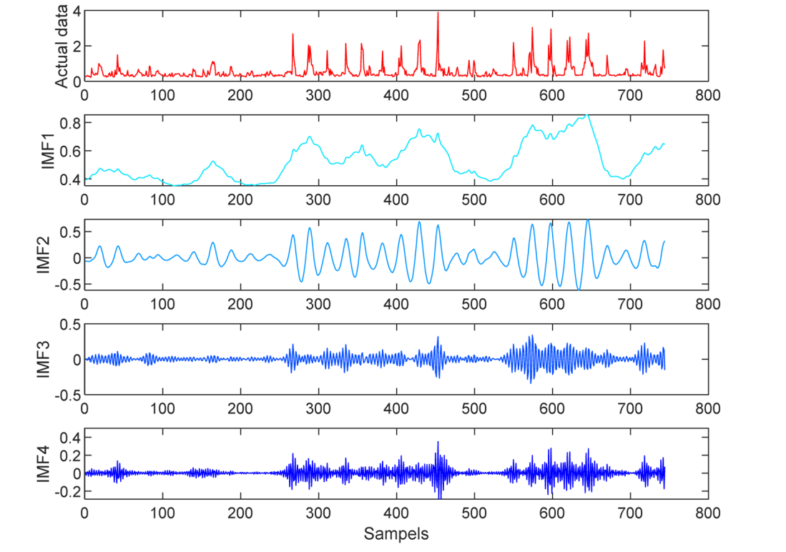
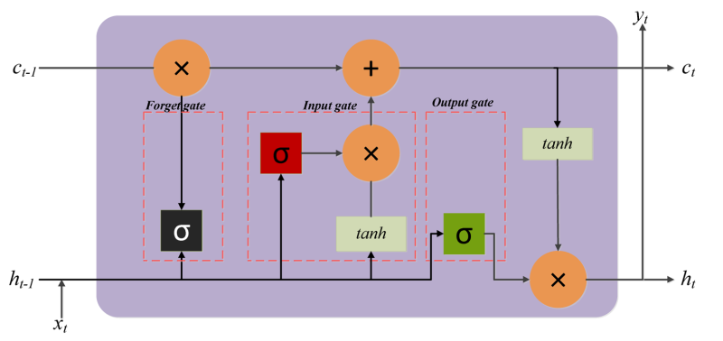
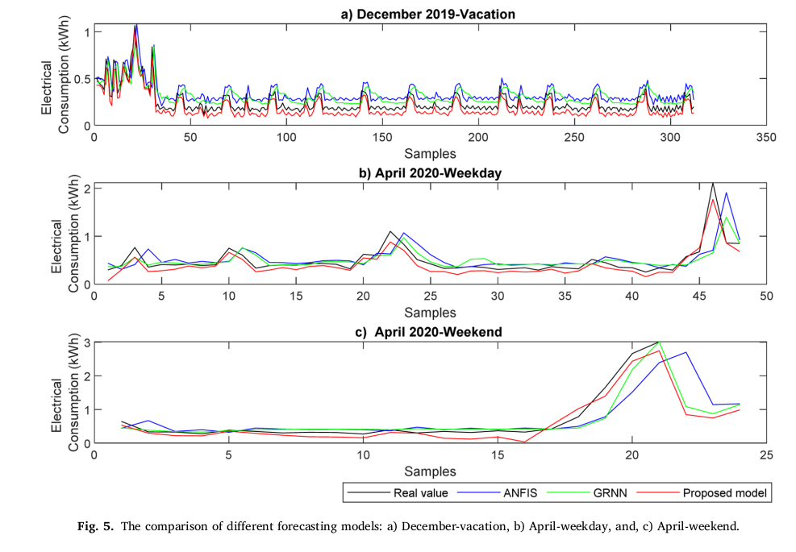
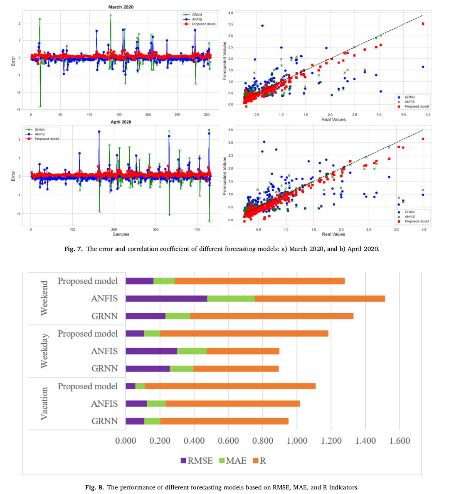
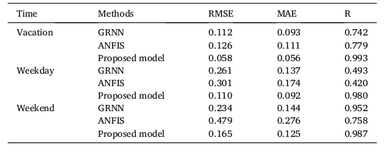

# Building electrical consumption patterns forecasting based on a novel hybrid deep learning model

June 2025, Results in Engineering 
- IF: 7.9
- JCI: 6/179/96.93%

## 연구 배경 및 목적
- 건물 전력소비 예측은 에너지 관리 최적화, 비용 절감, 효율 향상에 중요
- 건물 전력소비 패턴은 비선형적이고 복잡하여 기존 모델만으로는 정확한 예측에 한계 존재
- 본 논문의 목적은 MI 기반 특징선택, VMD, LSTM을 결합한 하이브리드 모델을 통해 스마트 주택의 전력소비를 더 정확하게 예측하는 것

## 데이터

- 데이터 출처: 미국 텍사스 휴스턴 소재 2층 스마트 주택
- 데이터 기간: 2019년~2020년
- 샘플링 타임: 1시간 단위
- 예측 대상: 시간별 전력소비량
- 포함 부하: 냉장고, 온수기, 조명, TV, 세탁기, 건조기, 에어컨 등 모든 가전제품 사용 포함

## 테스크 

### 입력 후보
- 과거 시점 전력소비량의 lag 값들 $x(t-1), x(t-2), ...$,
- 모드 lag 후보: $u_1(t-1), u_1(t-2), \dots$, $u_2(t-1), u_2(t-2), \dots$, ..., $u_4(t-1), u_4(t-2), \dots$
- 출력: 1시간 뒤의 전력소비량 x(t-1)

- Seq2Seq가 아닌 단일스텝 예측
  
## 연구 방법

### 전체 구조: 1. 원 전력소비 시계열 → VMD 분해 → 2. lag 입력 후보 구성 → 3. MI 기반 입력 선택 → 4. LSTM 예측 ##

- 핵심 목적: 원 신호의 복잡한 변동을 분해하고, 예측에 유효한 lag만 선택한 뒤, LSTM으로 미래 전력소비량 예측

---
## 1. VMD (Variational Mode Decomposition)

- 하나의 복잡한 시계열 신호 $f(t)$를 여러 개의 독립적인 mode $u_k$로 분해하는 방법
- 각 mode는 서로 다른 중심 주파수 $w_k$를 가지는 성분으로 해석
- 목적은 원 신호에 섞여 있는 여러 시간 스케일의 변동을 분리하는 것
- 각 mode는 가능한 한 좁은 주파수 대역만 갖도록 만듦
- 동시에 모든 mode를 더하면 원래 신호 $f(t)$가 되도록 제한
- **논문에서는 원 전력소비 시계열 $f(t)$를 VMD로 분해하여 $K=4$개의 mode $u_1(t), u_2(t), u_3(t), u_4(t)$를 얻음**

### 핵심 최적화 식

$$
\min_{u_k,w_k}
\left\{
\sum_k
\left\|
\partial_t
\left[
\left(\delta(t)+\frac{j}{\pi t}\right)*u_k(t)
\right]
e^{-j w_k t}
\right\|_2^2
\right\}
\quad \text{s.t.} \quad
\sum_k u_k = f(t)
$$

### 식의 의미

- $f(t)$: 원 전력소비 시계열
- $u_k$: 분해된 $k$번째 mode
- $w_k$: $k$번째 mode의 중심 주파수
- 목적함수: 각 mode의 대역폭을 최소화
- 제약조건: 모든 mode를 더하면 원 신호가 되도록 강제

---

## 2. 입력 후보 준비

- 원 전력소비 시계열의 과거값과 VMD로 분해된 각 모드의 과거값을 함께 입력 후보로 구성
- 원 신호 lag 후보는 $x(t-1), x(t-2), \dots, x(t-n)$ 형태
- 각 모드 lag 후보는 $u_1(t-1), \dots, u_1(t-n)$, $u_2(t-1), \dots, u_2(t-n)$, ..., $u_4(t-1), \dots, u_4(t-n)$ 형태
- 즉, 현재 시점 $t$에서 미래 전력소비량을 예측하기 위해 원 신호와 각 모드의 과거 정보를 모두 하나의 입력 후보 집합으로 준비
- 이렇게 하면 원 신호의 전체 시간 의존성과 분해된 주파수 성분별 시간 의존성을 함께 반영 가능

---
## 3. MI(Mutual Information) 기반 입력 선택

- 입력 변수와 목표 변수 사이의 의존성 또는 정보 공유 정도를 측정하는 지표
- 값이 클수록 해당 입력이 목표값 예측에 더 유용한 정보를 가진다고 해석 가능

### 논문에서 사용한 방식
- 먼저 원 신호 lag와 각 모드 lag로 구성된 입력 후보 집합을 준비
- 각 입력 후보와 미래 전력소비량 사이의 MI를 계산
- MI 값이 큰 입력일수록 목표값과 관련성이 높다고 판단
- 관련성이 낮거나 중복적인 후보는 제거
- 최종적으로 MI가 높은 입력들만 선택하여 예측 모델의 입력으로 사용

### 수식 

$$
MI(x,y)=\sum_{i=1}^{n}\sum_{j=1}^{m} P(x_i,y_j)\log_2\left(\frac{P(x_i,y_j)}{P(x_i)P(y_j)}\right)
$$

### 수식 의미

- $x$: 입력 후보 변수
- $y$: 목표 변수
- $x_i$: 입력 $x$가 속한 $i$번째 값 구간
- $y_j$: 목표값 $y$가 속한 $j$번째 값 구간
- $P(x_i)$: 입력이 $i$번째 구간에 들어갈 확률
- $P(y_j)$: 목표값이 $j$번째 구간에 들어갈 확률
- $P(x_i,y_j)$: 입력이 $i$번째 구간이고 동시에 목표값이 $j$번째 구간일 결합확률

### 시계열 데이터 샘플링 구조 (예시)
원본 데이터와 VMD를 통해 분해된 모드(IMF)들의 과거 지연(Lag) 값들이 어떻게 예측 모델의 '입력 후보군'으로 구성되는지 보여주는 구조입니다.

| 샘플 (Sample) | 타겟 (Target) | 후보 1 (Candidate 1) | 후보 2 (Candidate 2) | ... | 후보 m (Candidate m) |
| :---: | :---: | :---: | :---: | :---: | :---: |
| 시간 $t$ | $y_t$ (현재 전력량) | $IMF1_{t-1}$ (1시간 전) | $Original_{t-24}$ (24시간 전) | ... | $IMF4_{t-n}$ (n시간 전) |
| 1 | 1.25 | 0.85 | 1.10 | ... | 0.05 |
| 2 | 1.30 | 0.88 | 1.15 | ... | 0.04 |
| ... | ... | ... | ... | ... | ... |
| $N$ | 1.10 | 0.80 | 1.05 | ... | 0.06 |

* **$N$**: 전체 학습 데이터 샘플의 수 (예: 1년 치 시간당 데이터)
* **타겟 ($y$)**: 예측하고자 하는 목표 시점의 단일 전력 소비량
* **후보 변수 ($x$)**: 각 모드(IMF) 및 원본 데이터 시계열을 과거로 지연(Lag)시켜 만든 $N$ 크기의 데이터 벡터

---

## 4. LSTM(Long Short-Term Memory)를 이용한 예측

### LSTM 입력 형태

- LSTM 입력은 단일 1차원 시계열이 아니라, MI를 통해 선택된 변수들로 구성된 n차원 시계열
- 즉, 각 시점마다 하나의 값이 아니라 여러 입력 변수값을 묶은 feature vector가 들어감
- 시간축 방향으로는 시계열 구조를 가지며, 각 시점의 데이터는 n개의 변수로 구성된 벡터 형태

### 입력 벡터 표현

- 시점 $t$의 입력 벡터는 예를 들어 다음과 같이 표현 가능

$$
z_t = [z_{t,1}, z_{t,2}, \dots, z_{t,n}]
$$

- 여기서 $n$은 MI를 통해 선택된 입력 변수 개수
- 예를 들어 선택된 변수가 $x(t-1)$, $x(t-2)$, $u_1(t-1)$, $u_3(t-2)$라면

$$
z_t = [x(t-1), x(t-2), u_1(t-1), u_3(t-2)]
$$

### 전체 입력 시계열 형태

- LSTM은 이런 입력 벡터들이 시간 순서대로 나열된 형태를 받음

$$
[z_1, z_2, z_3, \dots, z_T]
$$

- 따라서 전체 입력은 길이 $T$의 시계열이며, 각 시점의 데이터 차원은 $n$인 multivariate time series 형태

### LSTM의 기본 계산

- 각 시점에서 LSTM은 현재 입력 벡터 $z_t$와 이전 hidden state $h_{t-1}$를 이용해 새로운 상태를 계산

$$
h_t = \mathrm{LSTM}(z_t, h_{t-1})
$$

- 즉, 현재 시점 입력과 이전 시점의 기억을 함께 사용하여 현재 상태를 업데이트

### 출력

- 최종 hidden state 또는 마지막 시점의 상태를 이용해 미래 전력소비량을 예측

$$
\hat{y}_t = W_y h_t + b_y
$$

- 여기서 $\hat{y}_t$는 예측된 미래 전력소비량

---
## 비교 베이스라인 모델

### ANFIS (Adaptive Neuro-Fuzzy Inference System)

- 퍼지 추론 시스템과 신경망 학습 방식을 결합한 모델
- 입력과 출력 사이의 비선형 관계를 규칙 기반으로 표현할 수 있는 것이 특징
- 핵심 개념: if-then 형태의 퍼지 규칙을 학습하여 복잡한 비선형 관계를 모델링

### GRNN (Generalized Regression Neural Network)

- 확률 기반 회귀 신경망 모델
- 학습 과정이 비교적 단순하고 비선형 함수 근사에 사용할 수 있음
- 핵심 개념: 새로운 입력과 비슷한 과거 입력 샘플일수록 더 큰 가중치를 주고, 그 출력값들을 반영하여 최종 예측값을 계산

---

## 결과

- 제안 모델은 vacation, weekday, weekend 모든 조건에서 ANFIS와 GRNN보다 더 낮은 RMSE, MAE를 기록
- 상관계수 $R$도 전반적으로 가장 높게 나타나 실제 패턴 추종 성능이 가장 우수
- 특히 vacation 조건에서 RMSE 0.058, MAE 0.056, $R=0.993$로 가장 좋은 성능 확인
- weekday 조건에서도 RMSE 0.110, MAE 0.092, $R=0.980$로 비교 모델 대비 우수한 결과 확인
- weekend 조건에서는 RMSE 0.165, MAE 0.125, $R=0.987$로 가장 안정적인 예측 성능 확인