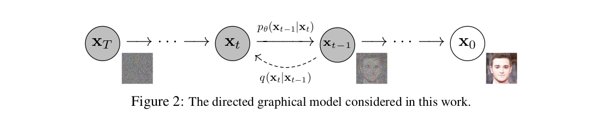

# DDPM(Denoising Diffusion Probabilistic Models)
Diffusion 기법중 DDPM을 다룬 논문(Denoising Diffusion Probabilistic Models)을 공부하고 정리하는 것을 목표로 한다.

**Diffusion Probabilistic Models (DPMs)**: Markov process를 기반으로 한 stochastic 생성 모델, 데이터에 점진적으로 노이즈를 추가하는 과정(Forward Process)을 포함하며, 이를 제거하며 원본 데이터를 복원하는 과정(Reverse Process)를 확률분포의 학습을 통해 최적화하는 모델

DDPM은 원래 이미지에 대한 노이즈의 복원을 목표로 설계되었지만,
핵심개념인 어떤 스테이트에서 다음 스테이트로 넘어가는 확률분포를 학습할 수 있는데서 착안하여 원하는 스테이트를 만들어내는 확률분포를 마르코프체인으로 정의하고 nagative logliklihood를 최소화하는 파라미터를 학습하여 정책 생성, motion planning에 사용할 수 있다.

기존 강화학습의 보상이 최대가 되는 액션의 집합을 찾는 방식을 통한 정책 생성 모델을 대체하는데 활발히 연구가 진행되고 있다.

### DDPM의 장점
정의가 비교적 간단하고 훈련이 효율적임.

**기존에는 원본 샘플을 생성할 수 있다는 명확한 증거가 부족했으나, 본 논문에서는 이를 수학적으로 증명함**

논문이 쓰일 당시 기준으로 SOTA 대비 높은 성능을 가짐 
## Background 
논문에서 설명하는 수식들을 이해하기 위한 기본 개념들을 설명하는 것을 목표로 한다. 

### 확률 분포 
아래는 평균 $\mu$, 분산 $\Sigma$를 따르는 확률분포를 의미한다. 
$$
\mathcal{N}(\mu, \Sigma)
$$
어떤 확률분포를 간단히 $q$나 $p_\theta$로 쓸 수 있다.(논문에서 주로 사용하는 기호)

아래는 확률변수 $x_0$가 어떤 확률분포 $q(x_0)$를 따른다는 의미이다. 
$$
x_0 \sim  q(x_0)
$$

$q(x_0)$는 확률밀도함수($x_0$가 어떤 구간에 있을 확률을 정의하는 함수)를 의미하기도 한다.

### likelihood

Probability, $p(x | \theta)$: 주어진 확률분포는 고정으로 두고 데이터가 달라지는 경우 샘플링 확률을 표현하는 단어 

**likelihood**, $L(\theta | x )$: 데이터는 고정으로 두고 확률분포의 변화에 포커스를 맞추어 해당 데이터를 샘플링할 확률을 표현하는 단어 

where, $\theta$: 확률분포를 구성하는 파라미터, $x$: 사건

likelihood와 확률밀도함수, 확률분포는 수식적으로는 같은 기호를 사용하나, 목적이 조금 다르다. 
예를 들어 $q(x_0)$는 확률 변수 $x_0$의 확률밀도함수인 동시에 해당 확률 분포에서 고정된 데이터 $x_0$가 샘플링될 likelihood를 의미할 수도 있다.
어떤 고정된 데이터를 두고 그 데이터를 포함하는 확률분포가 변화할때 얼마나 그 데이터를 샘플링할 확률이 높은지를 평가하는 최적화 도구로써 사용할 수 있기 때문이다. 

**다시말해 확률분포, 확률밀도함수, likelihood는 기호를 혼용에서 사용하므로 맥락에 맞게 이해하는 것이 중요하다.**

**diffusion의 목적은 모델이 원본데이터 $x_0$를 내놓을 likelihood를 높이는 것 즉, 특정한 확률분포를 찾도록 학습하는 것이다.** 

### foward process
$T$ 스텝 까지 데이터 $x_0$에 점진적으로 노이즈를 추가하는 과정

$$
q(x_{1:T} | x_0) = \prod_{t=1}^{T} q(x_t | x_{t-1})
$$
마르코프 체인으로 정의되며 각 $t$ 스텝에서 가우시안 노이즈가 추가된다. $q(x_t)$는 데이터 $x_t$가 샘플링되는 확률분포를 의미한다. 
$$
q(x_t | x_{t-1}) = \mathcal{N}(x_t; \sqrt{1 - \beta_t} x_{t-1}, \beta_t I)
$$
위식은 $x_t$의 값을 정의하기 위한 것으로써 아래와 같이 바꿔 쓸 수 있다. 
$$
x_t= \sqrt{1 - \beta_t}x_{t-1}+ \beta_t Iw_t
$$
$w_t \sim \mathcal{N}(0,1)$

$\beta_t$는 노이즈 스케줄이며 그 값이 커질 수록 노이즈도 커진다. 보통 시간이 지나면서 커기도록 설계되어 $x_0$는 완전한 가우시안 확률분포를 갖게된다.

$$
x_T \sim  \mathcal{N}(0,I)
$$

### reverse process
foward process를 역전시켜, 노이즈가 있는 상태 $x_T$에서 원본 데이터 $x_0$를 복원하는 과정
$$
q(x_{1:T} | x_0) = \prod_{t=1}^{T} q(x_t | x_{t-1})
$$

$x_t$에서 $x_{t-1}$로 복원하는 과정은 아래와 같이 쓸 수 있다.
$$
p_{\theta}(x_{t-1} | x_t) = \mathcal{N}(x_{t-1}; \mu_{\theta}(x_t, t), \Sigma_{\theta}(x_t, t))
$$
마찬가지로 위 식은 $x_{t-1}$를 정의하기 위한 수식으로 아래와 같이 바꿔쓸 수 있다. 
$$
x_{t-1}= \mu_{\theta}(x_t, t) +\Sigma_{\theta}(x_t, t)\tilde{w_t}
$$

$\tilde{w_t} \sim \mathcal{N}(0,1)$

$\mu_{\theta}(x_t, t)$와 $\Sigma_{\theta}(x_t, t)$는 평균벡터와 공분산 행렬로 학습의 대상이 된다. 

**여기까지는 개념들을 대략적으로 알아보았으며 더욱 디테일한 의미들은 아래에서 본격적으로 다뤄보자.**

### 학습목표(핵심)

**한편, 앞서 언급했듯이 DDPM의 학습 목표는 모델이 $x_0$를 내놓을 확률, likelihood를 $p_θ(x_0)$를 1에 가깝게 하는 것이다.** 

**$p_θ(x_0)$에 log를 씌우고 -를 붙이면 likelihood가 1에 가까워지면 nagative log likelihood는 무한대에서 0으로 빠르게 수렴하는 훌륭한 성질을 갖도록 잘 정의할 수 있고 그 기댓값을 loss function으로 사용한다.** 

**그러나 직접 loss function을 최적화하기 어려우므로 아래의 부등식이 성립함을 증명하여 우변을 최적화하는 방식으로 자연스럽게 loss function을 최적화하도록 한 것이 기존 2015년 논문의 핵심 컨트리뷰션이다.**
$$
\mathbb{E}[-\log p_{\theta}(x_0)] \leq \mathbb{E}_q \left[ -\log \frac{p_{\theta}(x_{0:T})}{q(x_{1:T} | x_0)} \right]
$$
위 식의 우변은 아래와 같이 KL Divergence의 합으로 표현될 수 있으므로 closed form으로 잘 해석이 가능하다.
$$
L = \mathbb{E}_q \left[ D_{KL}(q(x_T | x_0) \parallel p(x_T)) + \sum_{t>1} D_{KL}(q(x_{t-1} | x_t, x_0) \parallel p_{\theta}(x_{t-1} | x_t)) - \log p_{\theta}(x_0 | x_1) \right]
$$

$$
\mathbb{E}_q \left[ 
\underbrace{D_{KL} ( q(\mathbf{x}_T | \mathbf{x}_0) \parallel p(\mathbf{x}_T) )}_{L_T}
+ \sum_{t>1} \underbrace{D_{KL} ( q(\mathbf{x}_{t-1} | \mathbf{x}_t, \mathbf{x}_0) \parallel p_{\theta}(\mathbf{x}_{t-1} | \mathbf{x}_t) )}_{L_{t-1}}
- \underbrace{\log p_{\theta}(\mathbf{x}_0 | \mathbf{x}_1)}_{L_0}
\right]
$$
각 항에 대해 설명해보자

### 핵심, $L_{t-1}$: Denoising Process Loss

이 항이 reverse process의 핵심으로서 모델이 학습하는 주요 대상이다.

원본 $x_0$와 현재 상태 $x_t$가 주어질 때, 이전 상태 $x_{t-1}$의 확률 분포를
베이즈 정리로 $q(x_{t-1}|x_t,x_0)$ 잘 정의할 수 있다.

$$
q(x_{t-1} | x_t, x_0) = \frac{q(x_t | x_{t-1}, x_0) q(x_{t-1} | x_0)}{q(x_t | x_0)}
$$

본 논문의 핵심 컨트리뷰선 중 하나가 특정 $t$시간에서의 상태 $x_t$를 한번에 샘플할 수 있는 공식이 아래와 같이 주어질 수 있다는 것을 보인 것이다.
$$
q(x_t | x_0) = \mathcal{N} \left( x_t; \sqrt{\bar{\alpha}_t} x_0, (1 - \bar{\alpha}_t) I \right)
$$

where, $\alpha_t = 1 - \beta_t$, 

$\bar{\alpha}_t = \prod_{s=1}^{t} \alpha_s$

$x_0$가 주어지고 마르코프 체인을 통해 $x_t$가 정해졌다고 하면 $x_{t-1}$은 어떤 특정한 확률분포를 따를 수 밖에 없다, 즉 다시 말해 $x_{t-1}$이 특정한 값들 중 하나여야 $x_0$으로부터 $x_t$가 샘플링 될 수 있다!

**그러한 분포에 $q(x_{t-1}|x_t,x_0)$에 $p_\theta(x_{t-1}|x_t)$가 가깝도록 학습을 통해 조절!**

어떤 $\beta_t$, 노이즈 스케줄을 갖는 마르코프 체인에서 $x_T$가 나왔다고 가정하고 reverse process를 통해 그 이전 상태의 확률분포 만들어낼 수 있다. 그렇게 이전 상태 샘플링 해나가면서 만들러진 데이터 셋 $(x_T, \dots. x_t, x_{t-1},\dots, x_0)$은 foward 프로세스에서 만들어진 것들과 확률적으로 다를 수 있다. 그저 마르코프 체인의 $t-1$ 스텝에서 나올수 있는 확률이 있는 $x_{t-1}$를 찾는 것이다! 

**그렇게 $q(x_{t-1} | x_t, x_0)$에 가깝게 학습시킨 $p_\theta$는 $x_0$가 없어도 $x_T$만으로도 최종적으로 $x_0$를 반환할 확률이 있는 확률분포를 가지게 된다, 여기서 그 $x_0$를 최종적으로 반환할 확률밀도함수, 즉 라이클리후드를 높이는 것이 핵심**

**어떤 타임스텝 $T$, 어떤 노이즈 스케줄 $\beta_t$에 대한 마르코프 체인 즉 foward process가 $x_0$로부터 $x_T$를 만들어 내는 q 분포를 생성할 수 있다면, 그 $q$로부터 학습된 Reverse process가 x_0를 반환할 확률이 높은 확률분포 $p_\theta$를 가진다는걸 보장할 수 있다!!**

다시 말해 $L_{t-1}$항만 잘 학습해도 수학적으로는 모델이 $x_0$를 반환할 수 있음을 보장한다.

### $L_T$: Regularization Loss, $L_0$: Reconstruction Loss
$L_T$: $q(x_T|x_0)$와 $p(x_T)$의 차이를 최소화해야 하는데 $p(x_T)$는 가우시안 분포이므로 앞서 언급했던 $\beta_t$를 조절함으로써 $q(x_T|x_0)$가 가우시안 분포에 가깝도록 조절할 수 있다. 

$L_0$: 최종적으로 모델이 $x_0$를 얼마나 잘 복원하는지 직접적으로 평가하기 위해 따로 정의한다. 또한 $L_{t-1}$항에서 포워드 프로세스와 조금씩 다른 $x_{t-1}$를 샘플링하면 최종적으로 오차가 누적될 수 있기에 직접적으로 보정이 필요하다. 

---

## 기타 아이디어(내 생각)

가우시안 분포로 포워드 프로세스 정의했지만 현실의 노이즈 경향을 포함하여 최적화하고 싶다면 원본에서 노이즈로 가는 확률분포를 다른 모델을 통해 학습하면 어떨까?? 수학적으로 가능은 할까? 

---

## 관련 논문들
최신 논문을 중심으로, Arxiv와 IEEE에서 디퓨전 모델(DDPM)을 활용한 역강화학습(IRL), 모델 예측 제어(MPC) 및 정책 생성과 관련된 로봇 제어 응용 논문을 찾아 정리한 것이다.
### Diffusion Models in Robot Control (2023–2025)

Diffusion models (especially **denoising diffusion probabilistic models**, DDPMs) have rapidly been adopted in robotics for tasks like policy generation, inverse reinforcement learning (IRL), and model predictive control (MPC). Below we summarize several recent **ArXiv and IEEE** works (2023–2025) that focus on applying diffusion models to robot control, highlighting their key contributions, results, and available implementations.

## Diffusion for Inverse Reinforcement Learning (IRL)  
- **Extracting Reward Functions from Diffusion Models (NeurIPS 2023)** – *Nuti et al.* propose a novel IRL method that leverages diffusion models to derive reward functions ([Extracting Reward Functions from Diffusion Models | OpenReview](https://openreview.net/forum?id=NN60HKTur2&noteId=Xnpn7eZVbM#:~:text=Abstract%3A%20Diffusion%20models%20have%20achieved,under%20which%20it%20exists%20and)). They train two diffusion policies: one on low-reward behaviors and one on high-reward behaviors, then define a *relative reward function* that explains the difference between these behaviors ([Extracting Reward Functions from Diffusion Models | OpenReview](https://openreview.net/forum?id=NN60HKTur2&noteId=Xnpn7eZVbM#:~:text=Abstract%3A%20Diffusion%20models%20have%20achieved,under%20which%20it%20exists%20and)). By aligning the gradient of a neural reward function with the difference in diffusion model outputs, they successfully recover meaningful reward signals ([Extracting Reward Functions from Diffusion Models | OpenReview](https://openreview.net/forum?id=NN60HKTur2&noteId=Xnpn7eZVbM#:~:text=optimal%20trajectories,environments%2C%20and%20we%20demonstrate%20that)). The approach is validated in navigation tasks (recovering the true reward), and using the learned reward to guide the base diffusion policy yields significantly improved performance in locomotion benchmarks ([Extracting Reward Functions from Diffusion Models | OpenReview](https://openreview.net/forum?id=NN60HKTur2&noteId=Xnpn7eZVbM#:~:text=aligning%20the%20gradients%20of%20a,lower%20rewards%20to%20harmful%20images)). Notably, the method generalizes beyond robotics – they extract a “safety score” reward by comparing two image diffusion models, which correctly assigns low reward to harmful or NSFW images ([Extracting Reward Functions from Diffusion Models | OpenReview](https://openreview.net/forum?id=NN60HKTur2&noteId=Xnpn7eZVbM#:~:text=correct%20reward%20functions%20in%20navigation,lower%20rewards%20to%20harmful%20images)). *Official code is provided* on GitHub ([GitHub - FelipeNuti/diffusion-relative-rewards: Codebase for Extracting Reward Functions from Diffusion Models](https://github.com/FelipeNuti/diffusion-relative-rewards#:~:text=Extracting%20Reward%20Functions%20from%20Diffusion,Models)) for reproducibility.

## Diffusion Models for Model Predictive Control (MPC)  
- **Diffusion Model Predictive Control (D-MPC, 2024)** – *Zhou et al.* (DeepMind) introduce D-MPC, an MPC framework where both the policy proposal and dynamics model are represented by learned diffusion models ([Diffusion Model Predictive Control | Papers With Code](https://paperswithcode.com/paper/diffusion-model-predictive-control#:~:text=We%20propose%20Diffusion%20Model%20Predictive,based%20planning%20baselines)). At each control step, a diffusion model generates a multi-step action sequence, which is evaluated by a diffusion-based dynamics predictor; an MPC optimizer then selects the best action to execute ([Diffusion Model Predictive Control | Papers With Code](https://paperswithcode.com/paper/diffusion-model-predictive-control#:~:text=We%20propose%20Diffusion%20Model%20Predictive,based%20planning%20baselines)). This method achieved **state-of-the-art offline planning** results on the D4RL benchmark, outperforming prior model-based planners and matching top model-free RL methods ([Diffusion Model Predictive Control | Papers With Code](https://paperswithcode.com/paper/diffusion-model-predictive-control#:~:text=We%20propose%20Diffusion%20Model%20Predictive,based%20planning%20baselines)). It also demonstrated the ability to **adapt on-the-fly** to new reward functions and dynamics (thanks to its learned model), highlighting a key advantage of diffusion in MPC ([Diffusion Model Predictive Control | Papers With Code](https://paperswithcode.com/paper/diffusion-model-predictive-control#:~:text=We%20propose%20Diffusion%20Model%20Predictive,based%20planning%20baselines)). *(As of writing, no official code release is noted for D-MPC.)*

- **DIAL-MPC: Diffusion-Inspired Annealing for Legged MPC (2024)** – *Xue et al.* present **DIAL-MPC**, a **training-free** optimal control method that applies diffusion-style iterative refinements within a sampling-based MPC for quadrupeds ([Full-Order Sampling-Based MPC for Torque-Level Locomotion Control via Diffusion-Style Annealing | OpenReview](https://openreview.net/forum?id=6Mis923x58#:~:text=with%20high%20variance%2C%20which%20limits,challenging%20climbing%20tasks%20without%20any)). Instead of learning from data, DIAL-MPC uses a **noise annealing schedule (inspired by diffusion)** to gradually improve sequences of control inputs in real-time ([Full-Order Sampling-Based MPC for Torque-Level Locomotion Control via Diffusion-Style Annealing | OpenReview](https://openreview.net/forum?id=6Mis923x58#:~:text=with%20high%20variance%2C%20which%20limits,challenging%20climbing%20tasks%20without%20any)). This approach enables solving full-order, high-dimensional locomotion control on the fly – something traditional MPC struggles with. In experiments on a quadruped, DIAL-MPC cut tracking error by **13.4×** compared to standard MPPI-based MPC and even outperformed trained RL policies by ~50% on challenging uphill climbing tasks ([Full-Order Sampling-Based MPC for Torque-Level Locomotion Control via Diffusion-Style Annealing | OpenReview](https://openreview.net/forum?id=6Mis923x58#:~:text=with%20high%20variance%2C%20which%20limits,challenging%20climbing%20tasks%20without%20any)). It also powered a **real-world** quadruped to perform precise jumps with a payload, **without any learning** ([Full-Order Sampling-Based MPC for Torque-Level Locomotion Control via Diffusion-Style Annealing | OpenReview](https://openreview.net/forum?id=6Mis923x58#:~:text=landscape%20analysis%20of%20Model%20Predictive,free)). To the authors’ knowledge, DIAL-MPC is the first method to optimize a full robot dynamics model in real-time *without training*, highlighting the power of diffusion-style stochastic search in MPC ([Full-Order Sampling-Based MPC for Torque-Level Locomotion Control via Diffusion-Style Annealing | OpenReview](https://openreview.net/forum?id=6Mis923x58#:~:text=landscape%20analysis%20of%20Model%20Predictive,free)).

- **Diffusion Policy + MPC for Autonomous Drifting (CoRL 2024)** – *Djeumou et al.* developed a diffusion-based controller for aggressive **autonomous driving at the limits** (e.g. drifting) ([One Model to Drift Them All: Physics-Informed Conditional Diffusion Model for Driving at the Limits | OpenReview](https://openreview.net/forum?id=0gDbaEtVrd#:~:text=high,model%20matches%20the%20performance%20of)). They train a conditional diffusion model to capture the multimodal dynamics of a car at tire-friction limits, in a *physics-informed* way (the diffusion model learns to generate plausible vehicle dynamics parameters) ([One Model to Drift Them All: Physics-Informed Conditional Diffusion Model for Driving at the Limits | OpenReview](https://openreview.net/forum?id=0gDbaEtVrd#:~:text=the%20road%2C%20vehicle%2C%20and%20their,show%20that%20a%20single%20diffusion)). At runtime, the diffusion model is conditioned on live vehicle sensor data and integrated into a real-time MPC loop ([One Model to Drift Them All: Physics-Informed Conditional Diffusion Model for Driving at the Limits | OpenReview](https://openreview.net/forum?id=0gDbaEtVrd#:~:text=high,model%20matches%20the%20performance%20of)). This hybrid allows a **single diffusion policy** to control *different car models* (Toyota Supra and Lexus LC500) through complex drift maneuvers, adapting to various tires and road conditions on the fly ([One Model to Drift Them All: Physics-Informed Conditional Diffusion Model for Driving at the Limits | OpenReview](https://openreview.net/forum?id=0gDbaEtVrd#:~:text=of%20a%20physics,a%20general%2C%20reliable%20method%20for)). The diffusion-MPC controller matched the performance of expert-tuned controllers on each car and **outperformed them in generalization** – reliably handling unseen surfaces and vehicle setups ([One Model to Drift Them All: Physics-Informed Conditional Diffusion Model for Driving at the Limits | OpenReview](https://openreview.net/forum?id=0gDbaEtVrd#:~:text=a%20real,at%20the%20limits%20of%20handling)). This result (an **Outstanding Paper** at CoRL 2024) demonstrates that diffusion models can bring both **adaptability and robustness** to high-performance MPC, paving the way for general controllers that handle diverse vehicles and environments ([One Model to Drift Them All: Physics-Informed Conditional Diffusion Model for Driving at the Limits | OpenReview](https://openreview.net/forum?id=0gDbaEtVrd#:~:text=a%20real,at%20the%20limits%20of%20handling)).

## Diffusion-Based Policy Generation for Robot Control  
- **DiffuseLoco: Multi-Skill Locomotion Control (CoRL 2024)** – *Huang et al.* propose **DiffuseLoco**, a diffusion-based policy that learns **entirely from offline data** to control legged robots ([DiffuseLoco: Real-Time Legged Locomotion Control with Diffusion from Offline Datasets](https://diffuselo.co/#:~:text=learning%20methods,world)). They curate a large, multimodal dataset of quadruped locomotion skills (different gaits, motions, etc.) and train a diffusion model to generate the robot’s joint commands based on the current state and a desired skill ([DiffuseLoco: Real-Time Legged Locomotion Control with Diffusion from Offline Datasets](https://diffuselo.co/#:~:text=learning%20methods,world)). To deploy this in real time, DiffuseLoco uses a *receding-horizon* strategy (output short trajectories at 30 Hz) and handles observation delays common in physical systems ([DiffuseLoco: Real-Time Legged Locomotion Control with Diffusion from Offline Datasets](https://diffuselo.co/#:~:text=multimodal%20datasets%20with%20a%20diverse,based)). Impressively, a single DiffuseLoco policy can **seamlessly perform multiple skills** and transition between them, and it transfers **zero-shot** to a real quadruped robot with on-board compute ([DiffuseLoco: Real-Time Legged Locomotion Control with Diffusion from Offline Datasets](https://diffuselo.co/#:~:text=multimodal%20datasets%20with%20a%20diverse,based)). In real-world tests, DiffuseLoco showed **improved stability and tracking** accuracy compared to prior RL-based controllers and behavior cloning, thanks to learning from diverse outcomes in the offline data ([DiffuseLoco: Real-Time Legged Locomotion Control with Diffusion from Offline Datasets](https://diffuselo.co/#:~:text=control%20and%20delayed%20inputs%2C%20DiffuseLoco,possibilities%20for%20scaling%20up%20learning)). The authors provide a code release and a detailed project page for the community ([DiffuseLoco: Real-Time Legged Locomotion Control with Diffusion from Offline Datasets](https://diffuselo.co/#:~:text=Paper%20%20%20arXiv%20,Video%20%20%20Code)) ([DiffuseLoco: Real-Time Legged Locomotion Control with Diffusion from Offline Datasets](https://diffuselo.co/#:~:text=Overview)). **Figure:** DiffuseLoco’s workflow – a diffusion policy is trained on an offline dataset of simulated locomotion *skills* (left), and at deployment it generates actions in real time to control a physical quadruped (right), achieving robust multi-skill locomotion ([DiffuseLoco: Real-Time Legged Locomotion Control with Diffusion from Offline Datasets](https://diffuselo.co/#:~:text=learning%20methods,world)) ([DiffuseLoco: Real-Time Legged Locomotion Control with Diffusion from Offline Datasets](https://diffuselo.co/)).

- **3D Diffuser Actor: Vision-Language Policy via Diffusion (CoRL 2024)** – *Ke et al.* unify diffusion-based policy learning with **3D scene understanding** for robot manipulation ([[2402.10885] 3D Diffuser Actor: Policy Diffusion with 3D Scene Representations](https://arxiv.org/abs/2402.10885#:~:text=Actor%2C%20a%20neural%20policy%20equipped,model%2C%20we%20show%203D%20Diffuser)). Their **3D Diffuser Actor** model uses a *3D denoising transformer* that fuses information from multi-view camera depth (to build a 3D scene representation), natural language instructions, and robot proprioception, and then outputs a sequence of 6-DoF end-effector poses by diffusion denoising ([[2402.10885] 3D Diffuser Actor: Policy Diffusion with 3D Scene Representations](https://arxiv.org/abs/2402.10885#:~:text=action%20distributions%20conditioned%20on%20the,3D%20Diffuser%20Actor)) ([[2402.10885] 3D Diffuser Actor: Policy Diffusion with 3D Scene Representations](https://arxiv.org/abs/2402.10885#:~:text=Actor%2C%20a%20neural%20policy%20equipped,model%2C%20we%20show%203D%20Diffuser)). This approach set a new **state-of-the-art** on the RLBench benchmark, exceeding the previous best success rate by **18%** (absolute) in a multi-view setting ([[2402.10885] 3D Diffuser Actor: Policy Diffusion with 3D Scene Representations](https://arxiv.org/abs/2402.10885#:~:text=to%20predict%20the%20noise%20in,dramatically%20outperform%202D%20representations%2C%20regression)). It also outperformed prior methods on the CALVIN language-conditioned tasks (∼9% relative gain) and even learned to solve real-world pick-and-place tasks from just a handful of demonstrations ([[2402.10885] 3D Diffuser Actor: Policy Diffusion with 3D Scene Representations](https://arxiv.org/abs/2402.10885#:~:text=to%20predict%20the%20noise%20in,model%2C%20we%20show%203D%20Diffuser)). The key insight is that combining diffusion policies with richer 3D context (instead of 2D images alone) yields more generalizable and data-efficient skills. *(The official implementation of 3D Diffuser Actor has been released on GitHub, facilitating further research.)*

- **GENIMA: Generative Image as Action Models (CoRL 2024)** – *Shridhar et al.* introduce **Genima**, an innovative approach that turns an image diffusion model into a robot policy generator ([[2407.07875] Generative Image as Action Models](https://arxiv.org/abs/2407.07875#:~:text=capabilities%20such%20as%20image,Our%20method%20is%20also)). Genima fine-tunes a pre-trained **Stable Diffusion** model (originally for image generation) so that given the current RGB observation and a language instruction (e.g. *“open the box”*), it **draws an image of the robot arm’s target future pose** in the scene ([GENIMA](https://genima-robot.github.io/#:~:text=Genima%20is%20a%20behavior,to%20ignore%20the%20context%20and)). In these generated images, the robot’s key joints (gripper, wrist, etc.) are indicated as colored spheres at their desired positions a few timesteps ahead ([GENIMA](https://genima-robot.github.io/#:~:text=to%20joint,context%20and%20just%20follow%20targets)). A downstream controller then maps this *visualized goal* into actual joint trajectories, essentially using the diffusion model’s output as an action plan ([GENIMA](https://genima-robot.github.io/#:~:text=Genima%20is%20a%20behavior,to%20ignore%20the%20context%20and)). Genima was evaluated on **25 RLBench simulation tasks** and **9 real-world manipulation tasks**, and it outperformed state-of-the-art end-to-end visuomotor policies, especially in robustness to scene changes and generalization to novel objects ([[2407.07875] Generative Image as Action Models](https://arxiv.org/abs/2407.07875#:~:text=behavior,Our%20method%20is%20also)). Remarkably, despite using only 2D images (no depth or explicit 3D mapping), Genima’s performance was on par with advanced 3D policies ([[2407.07875] Generative Image as Action Models](https://arxiv.org/abs/2407.07875#:~:text=visual%20targets%20into%20a%20sequence,Our%20method%20is%20also)). This work suggests that large pre-trained image models can be repurposed for control — leveraging vast visual priors. The project’s website provides a demo video and open-source code/checkpoints for practitioners ([GENIMA](https://genima-robot.github.io/#:~:text=Dyson%20Robot%20Learning%20Lab)). **Figure:** In Genima, a diffusion model (with ControlNet) is prompted with the current scene (“tiled” camera views) and task (“open the box”), and it generates an image with visual markers for target positions (yellow/striped spheres) ([GENIMA](https://genima-robot.github.io/#:~:text=Genima%20is%20a%20behavior,to%20ignore%20the%20context%20and)). A control policy then drives the robot to those targets, achieving the desired action ([[2407.07875] Generative Image as Action Models](https://arxiv.org/abs/2407.07875#:~:text=capabilities%20such%20as%20image,Our%20method%20is%20also)) ([GENIMA](https://genima-robot.github.io/)).

- **Diff-Control: Stateful Diffusion Policy for Imitation (IROS 2024)** – *Liu et al.* address a common limitation of diffusion policies: lack of memory/state, which can lead to inconsistent actions in long tasks () (). They propose **Diff-Control**, which augments a diffusion policy with a **recursive Bayesian state model** (implemented via a ControlNet module) to make it **stateful** ([Enabling Stateful Behaviors for Diffusion-based Policy Learning](https://arxiv.org/html/2404.12539v1#:~:text=of%20which%20do%20not%20fully,Control%20achieves%20an%20average%20success)). In essence, Diff-Control doesn’t sample each action from scratch; instead, it conditions the diffusion process on previous actions and observations (like a differentiable filter maintaining belief of the system state) () ([Enabling Stateful Behaviors for Diffusion-based Policy Learning](https://arxiv.org/html/2404.12539v1#:~:text=utilizes%20a%20diffusion,Control)). This yields temporally coherent plans and reduces the uncertainty in action generation. Empirically, Diff-Control achieved much higher success rates (30–40% absolute improvement) on extended-horizon imitation learning tasks compared to stateless diffusion policies () ([Enabling Stateful Behaviors for Diffusion-based Policy Learning](https://arxiv.org/html/2404.12539v1#:~:text=based%20policies%E2%80%99%20uncertainty%20by%20making,Control)). For example, on complex multi-step manipulation routines, it reached about **72%** success, versus much lower for prior methods ([Enabling Stateful Behaviors for Diffusion-based Policy Learning](https://arxiv.org/html/2404.12539v1#:~:text=based%20policies%E2%80%99%20uncertainty%20by%20making,Control)). The approach, presented as an IEEE IROS 2024 paper, demonstrates that integrating **memory** into diffusion-based controllers can greatly enhance their reliability. The authors provide a public code repository ([Enabling Stateful Behaviors for Diffusion-based Policy Learning](https://arxiv.org/html/2404.12539v1#:~:text=based%20policies%E2%80%99%20uncertainty%20by%20making,Control)), making it easier to apply Diff-Control’s ideas to other imitation learning problems.

### References (2023–2025 key papers)  
- F. **Nuti**, T. Franzmeyer, J. F. Henriques. *“Extracting Reward Functions from Diffusion Models.”* NeurIPS 37, 2023.  ([Extracting Reward Functions from Diffusion Models | OpenReview](https://openreview.net/forum?id=NN60HKTur2&noteId=Xnpn7eZVbM#:~:text=Abstract%3A%20Diffusion%20models%20have%20achieved,under%20which%20it%20exists%20and)) ([Extracting Reward Functions from Diffusion Models | OpenReview](https://openreview.net/forum?id=NN60HKTur2&noteId=Xnpn7eZVbM#:~:text=aligning%20the%20gradients%20of%20a,lower%20rewards%20to%20harmful%20images)) (Oxford; **IRL via diffusion**, *code available*)  
- G. **Zhou**, S. Swaminathan, *et al.* *“Diffusion Model Predictive Control.”* arXiv:2410.05364, 2024. ([Diffusion Model Predictive Control | Papers With Code](https://paperswithcode.com/paper/diffusion-model-predictive-control#:~:text=We%20propose%20Diffusion%20Model%20Predictive,based%20planning%20baselines)) (Google DeepMind; **D-MPC framework**)  
- H. **Xue**, C. Pan, *et al.* *“Full-Order Sampling-Based MPC for Locomotion via Diffusion-Style Annealing (DIAL-MPC).”* arXiv/CoRR, 2024. ([Full-Order Sampling-Based MPC for Torque-Level Locomotion Control via Diffusion-Style Annealing | OpenReview](https://openreview.net/forum?id=6Mis923x58#:~:text=with%20high%20variance%2C%20which%20limits,challenging%20climbing%20tasks%20without%20any)) ([Full-Order Sampling-Based MPC for Torque-Level Locomotion Control via Diffusion-Style Annealing | OpenReview](https://openreview.net/forum?id=6Mis923x58#:~:text=landscape%20analysis%20of%20Model%20Predictive,free)) (Caltech/UCLA; **Legged MPC without training**)  
- F. **Djeumou**, T. J. Lew, *et al.* *“One Model to Drift Them All: Physics-Informed Diffusion for Driving at the Limits.”* CoRL 2024 (Outstanding Paper). ([One Model to Drift Them All: Physics-Informed Conditional Diffusion Model for Driving at the Limits | OpenReview](https://openreview.net/forum?id=0gDbaEtVrd#:~:text=high,model%20matches%20the%20performance%20of)) ([One Model to Drift Them All: Physics-Informed Conditional Diffusion Model for Driving at the Limits | OpenReview](https://openreview.net/forum?id=0gDbaEtVrd#:~:text=a%20real,at%20the%20limits%20of%20handling)) (TRI/Stanford; **adaptive car drifting controller**)  
- X. **Huang**, Y. Chi, *et al.* *“DiffuseLoco: Real-Time Legged Locomotion Control with Diffusion.”* CoRL 2024. ([DiffuseLoco: Real-Time Legged Locomotion Control with Diffusion from Offline Datasets](https://diffuselo.co/#:~:text=learning%20methods,world)) ([DiffuseLoco: Real-Time Legged Locomotion Control with Diffusion from Offline Datasets](https://diffuselo.co/#:~:text=environmental%20variations,models%20and%20diverse%20offline%20datasets)) (Berkeley; **offline multi-skill locomotion**, *code available*)  
- T.-W. **Ke**, N. Gkanatsios, K. Fragkiadaki. *“3D Diffuser Actor: Policy Diffusion with 3D Scene Representations.”* CoRL 2024. ([[2402.10885] 3D Diffuser Actor: Policy Diffusion with 3D Scene Representations](https://arxiv.org/abs/2402.10885#:~:text=Actor%2C%20a%20neural%20policy%20equipped,model%2C%20we%20show%203D%20Diffuser)) (CMU; **vision-language action diffusion**, *code available*)  
- M. **Shridhar**, Y. L. Lo, S. James. *“Generative Image as Action Models (Genima).”* CoRL 2024. ([[2407.07875] Generative Image as Action Models](https://arxiv.org/abs/2407.07875#:~:text=capabilities%20such%20as%20image,Our%20method%20is%20also)) ([GENIMA](https://genima-robot.github.io/#:~:text=Genima%20is%20a%20behavior,to%20ignore%20the%20context%20and)) (Dyson/Imperial; **image-conditioned diffusion policies**, *code available*)  
- X. **Liu**, F. Weigend, Y. Zhou, H. Ben Amor. *“Diff-Control: A Stateful Diffusion-Based Policy for Imitation Learning.”* IROS 2024 (IEEE). ([Enabling Stateful Behaviors for Diffusion-based Policy Learning](https://arxiv.org/html/2404.12539v1#:~:text=utilizes%20a%20diffusion,Control)) (ASU; **temporal consistency in diffusion policies**, *code available*)

