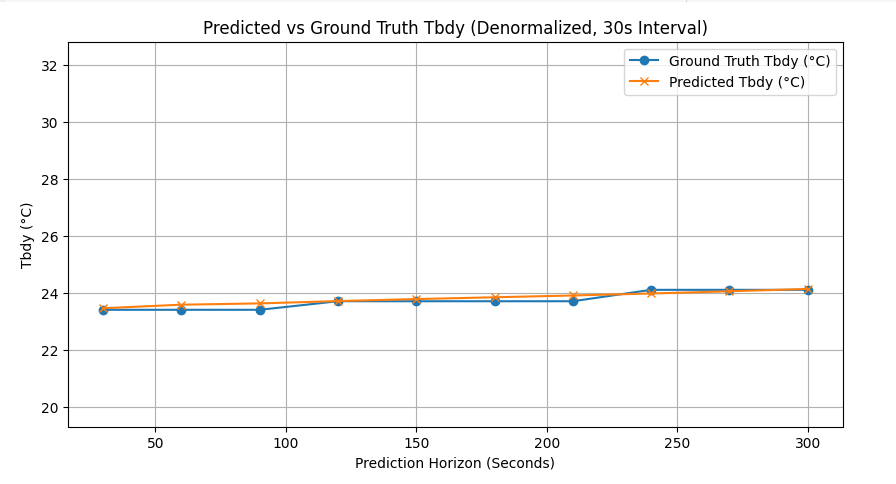
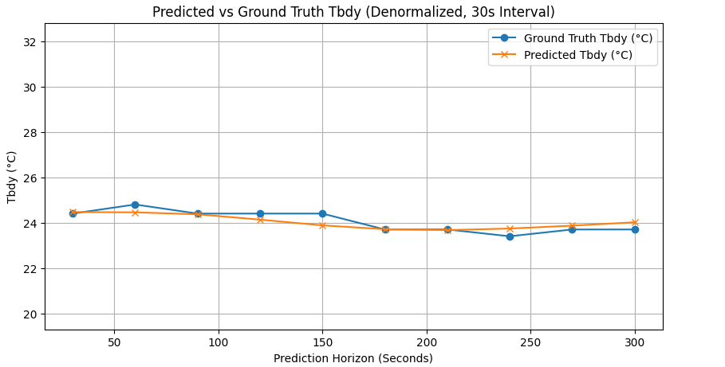
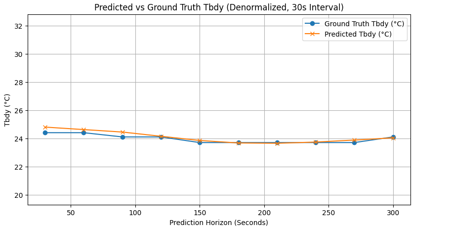
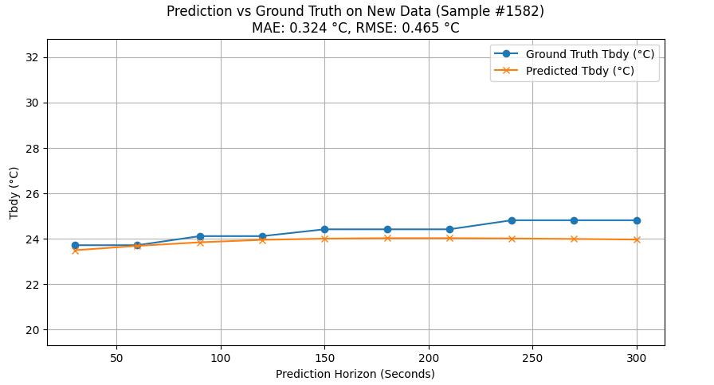
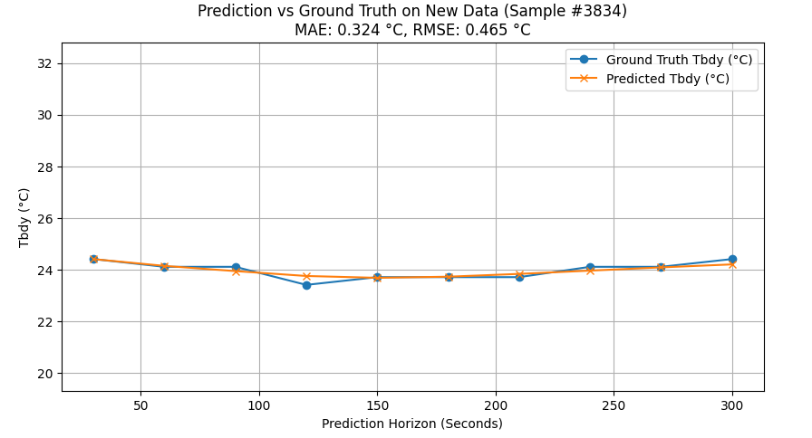
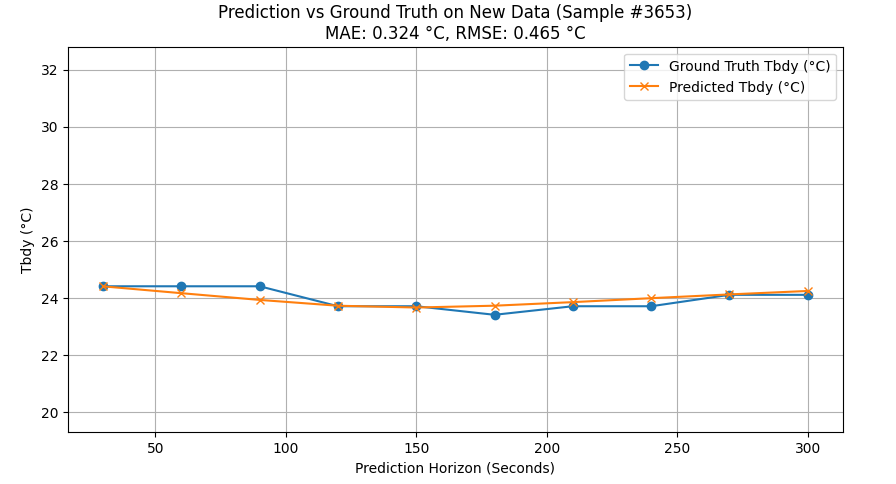
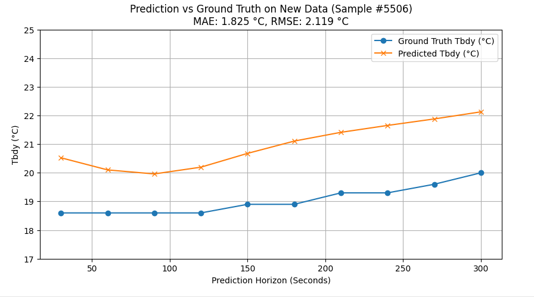
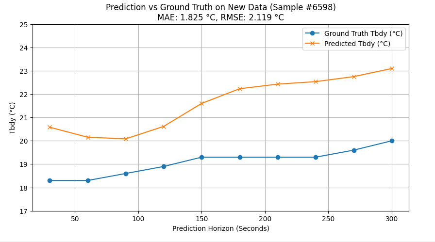
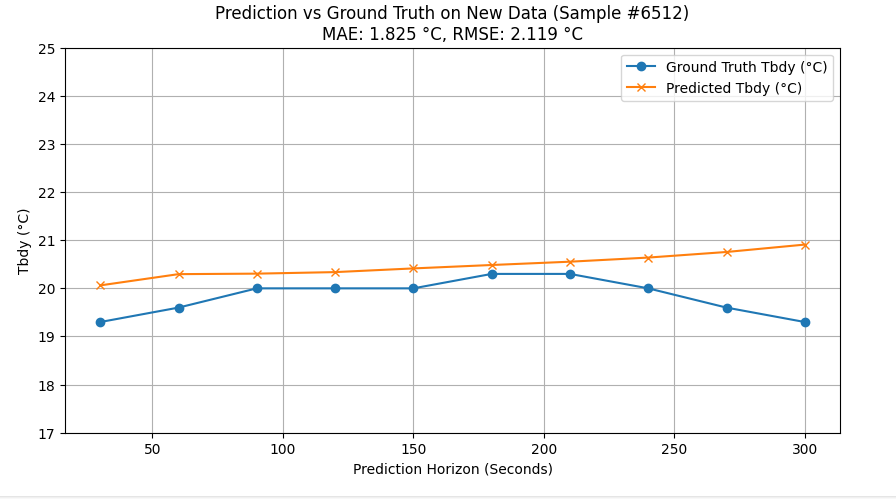

# LSTM을 이용한 시계열 온도 변화 예측 학습


## 학습 목표
스마트에어컨에서 수집된 LOG 데이터를 기반으로, 실내온도 예측에 유의미한 feature를 선정하고 정확도 높은 LSTM 예측 모델을 학습하는 것을 목표로 한다. 

이를 통해 학습된 LSTM의 히든 스테이트가 시간에 따라 변화하는 열부하(dynamic thermal load) 를 효과적으로 내포할 수 있을 것이라는 가정을 바탕으로 한다. 

궁극적으로 이 히든 스테이트를 강화학습 환경에서 상태(state)의 일부로 활용함으로써, 열부하에 대한 정보 부족으로 발생할 수 있는 서브옵티멀(suboptimal)한 제어 정책을 완화하고자 한다.


## LOG 데이터 형태


## 입력 및 출력 데이터 구조 요약

### 입력 데이터 (input)

| 변수명      | 의미                              | 시간 단위 | 시계열 길이 | 
|-------------|-----------------------------------|--------------|-------------------|
| Thmo On     | 냉방기 연속 가동 시간 (초)         | 5초         | 60개 (5분)  | 
| Tcon        | 희망 온도 (°C)                     | 5초         | 60개 (5분)  | 
| Frun        | 풍량 세기                          | 5초         | 60개 (5분)  | 
| Tpip_in     | 실내기로 들어가는 냉매 온도 (°C)   | 5초         | 60개 (5분)  | 
| Tpip_out    | 실내기에서 나오는 공기 온도 (°C)   | 5초         | 60개 (5분)  | 
| Tod         | 외기 온도 (°C)                     | 5초         | 60개 (5분)  | 
| Power       | 지난 1분간 사용 전력 (kWh 등)      | 5초         | 60개 (5분)  | 
| Tbdy        | 실내 온도 (°C)                     | 5초         | 60개 (5분)  | 

> 총 입력 형태: **(60, 8)**  
> 60개의 시계열 step × 8개 feature

---

### 출력 데이터 (output)

| 변수명  | 의미              | 시간 해상도 | 시계열 길이 |
|---------|-------------------|--------------|--------------|
| Tbdy    | 실내 온도 (예측)  | 30초        | 10개 (5분)   | 

> 출력은 30초 간격으로 미래 5분간의 실내온도(Tbdy) 예측  
> 모델 출력 형태: **(10,1)**

---
24년 9월 3일 경남사무실 데이터를 이용하여 학습 

### 모델 파라미터
```
히든 스테이트 64 차원

에포크 30~50 

loss function: MSE
```

## 모델 성능 결과
### 경남 사무실 9월 3일 데이터로 모델 테스트 결과




### 경남 사무실 9월 4일 데이터로 모델 테스트 결과




### 공대 7호관 4월 28일 데이터로 모델 테스트 결과





9월 3일 경남 사무실 데이터를 기반으로 학습한 모델은 해당 날짜에 대해 우수한 예측 성능을 보였고 9월 4일 데이터에서도 성능이 안정적으로 유지되었다. 

그러나 4월 28일 공대 7호관 데이터에 대해 예측한 결과, 전반적인 경향성은 따라 갔으나 온도 예측값이 실제보다 높게 나타났으며, 이는 계절적 특성이 반영되지 않았음을 의미한다. 

따라서 보다 일반화된 예측 성능을 확보하기 위해서는 다양한 월별 데이터를 포함한 학습이 필요함을 의미한다.


## 사용한 코드
### 변수들 간 상관관계 분석
```py
# 구글 코랩용: 파일 업로드 라이브러리 호출
from google.colab import files
import pandas as pd
import seaborn as sns
import matplotlib.pyplot as plt

# 파일 업로드
uploaded = files.upload()

# 업로드된 파일 읽기
# uploaded은 딕셔너리 형태라 key()로 파일 이름 가져올 수 있음
filename = list(uploaded.keys())[0]
df = pd.read_csv(filename)

# 사용할 컬럼만 선택
features = ['Thmo On', 'Tcon', 'Frun', 'Tpip_in', 'Tpip_out', 'Tod', 'Power', 'Tbdy']
df_selected = df[features]

# 상관계수 계산
corr_matrix = df_selected.corr()

# 히트맵 시각화
plt.figure(figsize=(10, 8))
sns.heatmap(corr_matrix, annot=True, cmap='coolwarm', fmt='.2f')
plt.title('Feature Correlation Heatmap')
plt.show()
```


### CSV 파일 업로드 및 데이터 준비
```PY
from google.colab import files
import pandas as pd
import numpy as np

# 파일 업로드
uploaded = files.upload()

# 파일 읽기
filename = list(uploaded.keys())[0]
df = pd.read_csv(filename)

# 사용할 컬럼 선택
features = ['Auto Id', 'Thmo On', 'Tcon', 'Frun', 'Tpip_in', 'Tpip_out', 'Tod', 'Power', 'Tbdy']
df = df[features]

# 결측치 처리 (간단히 드랍)
df = df.dropna()

# 정규화 (MinMaxScaler)
from sklearn.preprocessing import MinMaxScaler

scaler = MinMaxScaler()
# Auto id는 정규화에서 제외
df_scaled = df.copy()
df_scaled[df.columns[1:]] = scaler.fit_transform(df[df.columns[1:]])
```

### 데이터셋 정의
```py
from torch.utils.data import Dataset, DataLoader
import torch

class HVACDatasetV2(Dataset):
    def __init__(self, data, input_window, output_window, stride, output_stride):
        self.data = data
        self.input_window = input_window
        self.output_window = output_window
        self.stride = stride
        self.output_stride = output_stride
        self.X, self.Y = self.create_sequences()

    def create_sequences(self):
        X = []
        Y = []
        for auto_id, group in self.data.groupby('Auto Id'):
            group = group.drop(columns=['Auto Id']).values
            L = len(group)
            for i in range(0, L - self.input_window - self.output_window * self.output_stride, self.stride):
                x_seq = group[i:i+self.input_window, :]
                # output_stride 만큼 건너뛴 Tbdy 예측
                y_seq = group[i+self.input_window : i+self.input_window+self.output_window*self.output_stride : self.output_stride, -1]
                X.append(x_seq)
                Y.append(y_seq)
        return torch.tensor(X, dtype=torch.float32), torch.tensor(Y, dtype=torch.float32)


    def __len__(self):
        return len(self.X)

    def __getitem__(self, idx):
        return self.X[idx], self.Y[idx]
```

### 데이터 준비
```py
# 하이퍼파라미터
input_window = 60
output_window = 10
stride = 1
output_stride = 6

# 새로 만든 데이터셋 클래스 활용
dataset = HVACDatasetV2(df_scaled, input_window, output_window, stride, output_stride)

# 학습/검증 분할
train_size = int(0.8 * len(dataset))
val_size = len(dataset) - train_size
train_dataset, val_dataset = torch.utils.data.random_split(dataset, [train_size, val_size])

# 데이터로더 생성
batch_size = 64
train_loader = DataLoader(train_dataset, batch_size=batch_size, shuffle=True)
val_loader = DataLoader(val_dataset, batch_size=batch_size, shuffle=False)
```

### LSTM 인코더 디코더 모델
```PY
import torch.nn as nn

class Encoder(nn.Module):
    def __init__(self, input_dim, hidden_dim, num_layers=1):
        super(Encoder, self).__init__()
        self.lstm = nn.LSTM(input_dim, hidden_dim, num_layers, batch_first=True)

    def forward(self, x):
        outputs, (hidden, cell) = self.lstm(x)
        return hidden, cell

class Decoder(nn.Module):
    def __init__(self, hidden_dim, output_dim, num_layers=1):
        super(Decoder, self).__init__()
        self.lstm = nn.LSTM(hidden_dim, hidden_dim, num_layers, batch_first=True)
        self.fc = nn.Linear(hidden_dim, output_dim)

    def forward(self, hidden, cell, output_len):
        batch_size = hidden.size(1)
        outputs = []
        input_step = torch.zeros((batch_size, 1, hidden.size(2))).to(hidden.device)  # 제로 입력
        for _ in range(output_len):
            output, (hidden, cell) = self.lstm(input_step, (hidden, cell))
            pred = self.fc(output.squeeze(1))  # (batch, output_dim)
            outputs.append(pred.unsqueeze(1))
            input_step = output
        outputs = torch.cat(outputs, dim=1)  # (batch, output_len, output_dim)
        return outputs

class LSTMSeq2Seq(nn.Module):
    def __init__(self, input_dim, hidden_dim, output_len):
        super(LSTMSeq2Seq, self).__init__()
        self.encoder = Encoder(input_dim, hidden_dim)
        self.decoder = Decoder(hidden_dim, 1)
        self.output_len = output_len

    def forward(self, src):
        hidden, cell = self.encoder(src)
        output = self.decoder(hidden, cell, self.output_len)
        return output.squeeze(-1)  # (batch, output_len)
```

### 학습 설정
```PY
# 디바이스 설정
device = torch.device("cuda" if torch.cuda.is_available() else "cpu")

# 모델 생성
input_dim = 8  # 입력 피처 개수
hidden_dim = 64
output_len = output_window

model = LSTMSeq2Seq(input_dim, hidden_dim, output_len).to(device)

# 손실함수와 옵티마이저
criterion = nn.MSELoss()
optimizer = torch.optim.Adam(model.parameters(), lr=1e-3)
```

### 학습 루프
```PY
from tqdm import tqdm
import matplotlib.pyplot as plt

n_epochs = 50
train_losses = []
val_losses = []

for epoch in range(n_epochs):
    model.train()
    train_loss = 0

    # tqdm progress bar
    loop = tqdm(train_loader, desc=f"Epoch {epoch+1}/{n_epochs}", leave=False)
    for X_batch, Y_batch in loop:
        X_batch, Y_batch = X_batch.to(device), Y_batch.to(device)
        optimizer.zero_grad()
        output = model(X_batch)
        loss = criterion(output, Y_batch)
        loss.backward()
        optimizer.step()
        train_loss += loss.item()
        loop.set_postfix(loss=loss.item())

    avg_train_loss = train_loss / len(train_loader)
    train_losses.append(avg_train_loss)

    model.eval()
    val_loss = 0
    with torch.no_grad():
        for X_batch, Y_batch in val_loader:
            X_batch, Y_batch = X_batch.to(device), Y_batch.to(device)
            output = model(X_batch)
            loss = criterion(output, Y_batch)
            val_loss += loss.item()

    avg_val_loss = val_loss / len(val_loader)
    val_losses.append(avg_val_loss)

    print(f"[{epoch+1}/{n_epochs}] Train Loss: {avg_train_loss:.6f} | Val Loss: {avg_val_loss:.6f}")
```

### 손실 시각화
```py
# 모델을 evaluation 모드로 전환
model.eval()

# 검증 데이터셋에서 하나의 배치를 가져오기
X_batch, Y_batch = next(iter(val_loader))
X_batch, Y_batch = X_batch.to(device), Y_batch.to(device)

# 예측
with torch.no_grad():
    y_pred = model(X_batch)  # (batch_size, output_len)

# CPU로 옮기고 numpy 변환
y_pred = y_pred.cpu().numpy()
y_true = Y_batch.cpu().numpy()

import random
# 하나의 샘플만 선택
sample_idx = random.randint(0, y_pred.shape[0] - 1)
predicted = y_pred[sample_idx]      # 정규화된 예측
ground_truth = y_true[sample_idx]   # 정규화된 실제

# 30초 간격 시간축 생성
time_axis = np.arange(30, 30 * (len(ground_truth) + 1), 30)

# ✅ 정규화 해제 (Tbdy는 마지막 feature이므로 열 index = -1)
# scaler는 원래 전체 feature (8개)에 대해 fit 되었으므로, Tbdy만 복원해야 함

tbdy_min = scaler.data_min_[-1]
tbdy_max = scaler.data_max_[-1]

predicted_real = predicted * (tbdy_max - tbdy_min) + tbdy_min
ground_truth_real = ground_truth * (tbdy_max - tbdy_min) + tbdy_min

# ✅ Plot
import matplotlib.pyplot as plt

plt.figure(figsize=(10, 5))
plt.plot(time_axis, ground_truth_real, label='Ground Truth Tbdy (°C)', marker='o')
plt.plot(time_axis, predicted_real, label='Predicted Tbdy (°C)', marker='x')
plt.xlabel('Prediction Horizon (Seconds)')
plt.ylabel('Tbdy (°C)')
plt.title('Predicted vs Ground Truth Tbdy (Denormalized, 30s Interval)')
plt.ylim(tbdy_min - 1, tbdy_max + 1)  # y축 확대
plt.legend()
plt.grid(True)
plt.show()
```

### 다른 날짜 불러오기 및 전처리
```PY
from google.colab import files
import pandas as pd

# 📂 1. 파일 업로드
uploaded = files.upload()  # 파일 업로드 창이 뜸

# 📄 2. 업로드된 파일명 추출
filename = list(uploaded.keys())[0]

# 📊 3. 데이터 불러오기
new_df = pd.read_csv(filename)

# ✅ 4. Feature 선택 및 결측치 제거
features = ['Auto Id', 'Thmo On', 'Tcon', 'Frun', 'Tpip_in', 'Tpip_out', 'Tod', 'Power', 'Tbdy']
new_df = new_df[features].dropna()

# 🔄 5. 기존 scaler를 사용하여 정규화
new_df_scaled = new_df.copy()
new_df_scaled[new_df.columns[1:]] = scaler.transform(new_df[new_df.columns[1:]])
```
### 새로운 데이터셋 생성
```py
new_dataset = HVACDatasetV2(
    new_df_scaled,
    input_window=60,
    output_window=10,
    stride=1,
    output_stride=6
)

new_loader = DataLoader(new_dataset, batch_size=64, shuffle=False)
```

### 모델 예측 및 성능검증
```py
from sklearn.metrics import mean_absolute_error, mean_squared_error
import numpy as np
import matplotlib.pyplot as plt

# 1. 모델 평가 모드
model.eval()
all_preds = []
all_trues = []

# 2. 배치별 예측 수집
with torch.no_grad():
    for X_batch, Y_batch in new_loader:
        X_batch = X_batch.to(device)
        Y_batch = Y_batch.to(device)

        pred = model(X_batch)
        all_preds.append(pred.cpu().numpy())
        all_trues.append(Y_batch.cpu().numpy())

# 3. 전체 병합
preds = np.concatenate(all_preds, axis=0)  # (전체 샘플 수, output_len)
trues = np.concatenate(all_trues, axis=0)

# 4. 정규화 해제
tbdy_index = new_df.columns[1:].get_loc('Tbdy')
tbdy_min = scaler.data_min_[tbdy_index]
tbdy_max = scaler.data_max_[tbdy_index]

preds_real = preds * (tbdy_max - tbdy_min) + tbdy_min
trues_real = trues * (tbdy_max - tbdy_min) + tbdy_min

# 5. 성능 지표 계산
mae = mean_absolute_error(trues_real.flatten(), preds_real.flatten())
mse = mean_squared_error(trues_real.flatten(), preds_real.flatten())
rmse = np.sqrt(mse)

print(f"New Data Evaluation — MAE: {mae:.4f} °C, RMSE: {rmse:.4f} °C")

import random
# 6. 시각화 (0번째 샘플을 예시로 출력)
sample_idx = random.randint(0, len(preds_real) - 1)
pred_sample = preds_real[sample_idx]    # (output_len,)
true_sample = trues_real[sample_idx]    # (output_len,)

# 시간축 생성: 30초 간격, 예측 스텝 수만큼
time_axis = np.arange(30, 30 * (len(true_sample) + 1), 30)

# 7. Plot
plt.figure(figsize=(10, 5))
plt.plot(time_axis, true_sample, label='Ground Truth Tbdy (°C)', marker='o')
plt.plot(time_axis, pred_sample, label='Predicted Tbdy (°C)', marker='x')
plt.xlabel('Prediction Horizon (Seconds)')
plt.ylabel('Tbdy (°C)')
plt.title(f'Prediction vs Ground Truth on New Data (Sample #{sample_idx})\nMAE: {mae:.3f} °C, RMSE: {rmse:.3f} °C')
plt.ylim(tbdy_min - 1, tbdy_max + 1)
plt.grid(True)
plt.legend()
plt.show()
```


## 학습한 모델 Local에 다운로드
### 내 컴퓨터로 다운로드
```py
# 1. 모델 저장
torch.save(model.state_dict(), "lstm_seq2seq_tbdy_model.pt")

# 2. 확인
import os
print("Saved files:", os.listdir())

# 3. 다운로드
from google.colab import files
files.download("lstm_seq2seq_tbdy_model.pt")
```

### Colab에서 로컬 모델 파일 업로드하여 불러오기
```py
from google.colab import files
uploaded = files.upload()  # 파일 업로드 창이 뜸

# 예: lstm_seq2seq_tbdy_model.pt 업로드했다고 가정
model.load_state_dict(torch.load("lstm_seq2seq_tbdy_model.pt"))
model.eval()
```