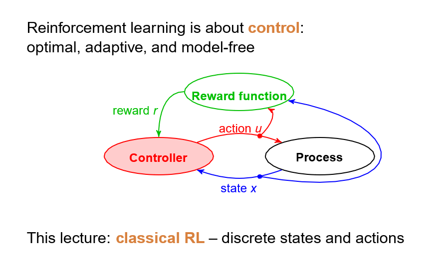

# Reinforcement Machin Learnig


제어특강 마지막 차시에서 배운 강화학습의 내용을 정리하는 것을 목표로 한다.

## 강화학습 기본 개념


controller: 행동(action, 
𝑢
u)을 결정하는 역할을 한다.

reward function: 행동에 대한 성과를 평가하여 보상(reward, r)을 제공한다.

state: 환경이 현재 어떤 상태에 있는지 나타냄

process: state 및 action과 상호작용하며 일어나는 시스템의 동적 변화를 의미 

```
1. Controller는 현재 상태(
𝑥)를 기반으로 행동(𝑢)을 선택.
2. Process는 행동
(𝑢)을 반영하여 새로운 상태(𝑥)로 변환.
3. Reward function이 해당 행동(𝑢)에 대한 보상(𝑟)을 제공.
4. Controller는 이 정보를 학습하여 더 나은 행동을 하도록 개선.
```

## 강화학습의 특성
Optimal (최적화): 최적의 정책을 찾는 과정.

Adaptive (적응형): 환경의 변화에 적응할 수 있음.

Model-free (모델 프리): 환경 모델 없이 학습 가능.

**강화학습에서 다음 상태$x^t$는 현재 상태 $x$와 행동 $u$에 의해 결정됨 이는 입력과 상태에 따라 다음 상태가 정해지는 이산상태방정식 모델돠 매우 유사함!!**

상태(state)와 행동(action)을 이산적인 값으로 다루어 설명할 수 있다. 