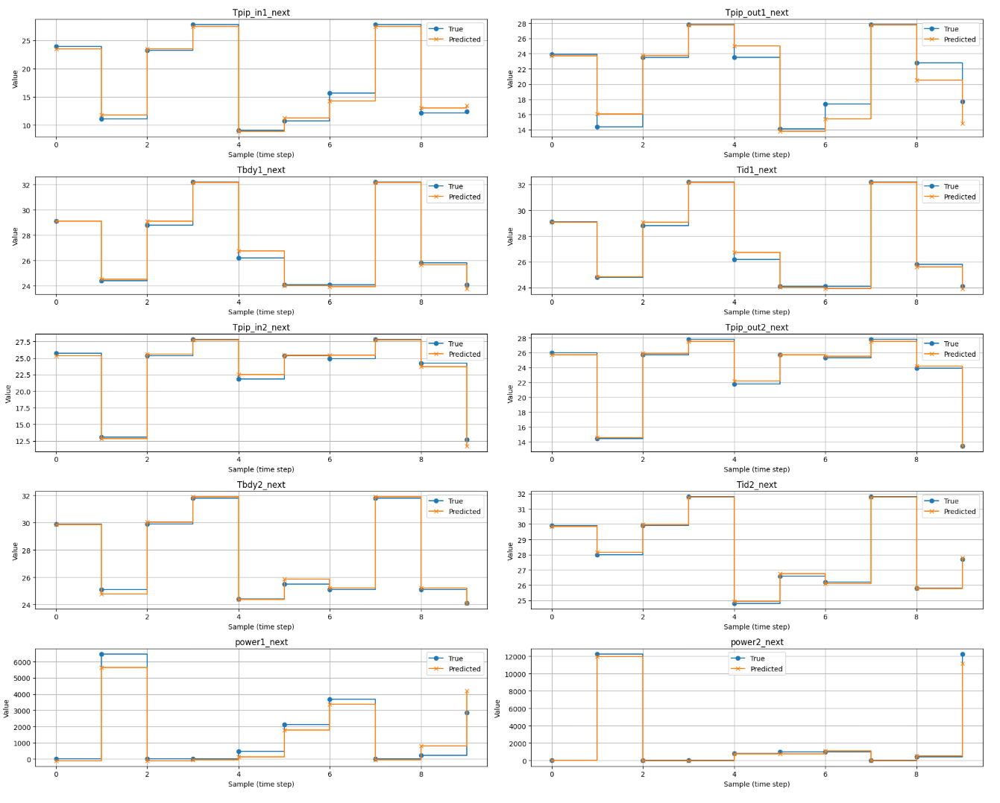
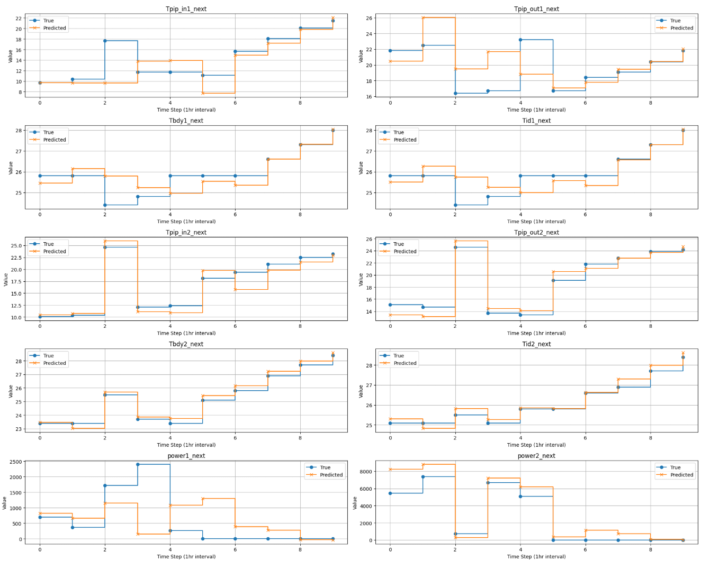

# Transition Function by ANN
ANN을 이용하여 현재 상태와 액션을 인풋으로 받아 다음 5분 뒤의 상태를 아웃풋으로 산출하는 전이함수를 개발하는 것을 목표로 한다.

## 목표 개선 사항
1. 5분간 누적 power를 계산해서 기존 power를 대체

2. 학습데이터를 하나의 파일이 아니라 여러 파일을 동시에 넣을 수 있게 해서 다른 사무실, 다른 날짜의 데이터 풍부하게 학습할 수 있게 셋팅

3. 샘플 테스트에서 임의로 데이터 셋 뽑는게 아니라 임의로 하되, 모든 샘플을 시계열로 1시간 단위로 연결된 데이터로 뽑아서 플롯 

4. 학습에 사용하지 않은 데이터셋도 파일 업로드하면 테스트셋으로 활용할 수 있도록 개선 


## 결과 
학습에 사용한 데이터와 같은 날짜의 발리드 데이터셋에 대해서는 높은 예측률 보이지만

다른 날짜의 파일에 대해선 예측에 다소 약한 모습 보임

-> 드롭아웃 추가등 추가적인 개선 필요


### 학습에 사용한 데이터와 같은 날짜의 데이터에 대한 예측


### 다른 날짜의 데이터에 대한 예측


## 코드
### 파일 업로드 및 학습 
여러 데이터 업로드
```py 
# ✅ 라이브러리
import pandas as pd
import numpy as np
from datetime import datetime
from google.colab import files

# ✅ 업로드
uploaded = files.upload()  # 여러 개 업로드 가능
```

데이터 가공
```py
# ✅ 보조 함수: 날짜 추출 및 Time 보정
def attach_date_to_time(df, filename):
    date_str = filename.split('_')[-1].split('.')[0]  # 예: '20240909'
    date_obj = datetime.strptime(date_str, "%Y%m%d")
    df['Time'] = pd.to_datetime(df['Time'], format='%H:%M:%S', errors='coerce')
    df['Time'] = df['Time'].apply(lambda t: datetime.combine(date_obj.date(), t.time()) if pd.notnull(t) else pd.NaT)
    return df

# ✅ 보조 함수: 유니크 파워값 합산
def last_5_unique_power_sum(series, window=60):
    result = [np.nan] * window
    for i in range(window, len(series)):
        past_window = series.iloc[i - window:i]
        unique_recent = []
        for j in range(len(past_window) - 1, -1, -1):
            val = past_window.iloc[j]
            if val not in unique_recent:
                unique_recent.append(val)
            if len(unique_recent) == 5:
                break
        result.append(sum(unique_recent))
    return pd.Series(result, index=series.index)

# ✅ 파일별로 merged 데이터 생성
merged_all = []
prediction_step = 60

for fname in uploaded:
    df = pd.read_csv(fname)
    df = attach_date_to_time(df, fname)
    df.columns = df.columns.str.strip()
    df = df.sort_values(['Time', 'Auto Id'])

    df1 = df[df['Auto Id'] == 1].reset_index(drop=True)
    df2 = df[df['Auto Id'] == 2].reset_index(drop=True)

    df1['power1'] = last_5_unique_power_sum(df1['Power']).reset_index(drop=True)
    df2['power2'] = last_5_unique_power_sum(df2['Power']).reset_index(drop=True)

    df1 = df1.rename(columns={'Tcon': 'tcon1', 'Tpip_in': 'Tpip_in1', 'Tpip_out': 'Tpip_out1',
                              'Tbdy': 'Tbdy1', 'Tid': 'Tid1'})
    df2 = df2.rename(columns={'Tcon': 'tcon2', 'Tpip_in': 'Tpip_in2', 'Tpip_out': 'Tpip_out2',
                              'Tbdy': 'Tbdy2', 'Tid': 'Tid2'})

    merged = pd.merge(
        df1[['Time', 'tcon1', 'Tpip_in1', 'Tpip_out1', 'Tbdy1', 'Tid1', 'Tod', 'power1']],
        df2[['Time', 'tcon2', 'Tpip_in2', 'Tpip_out2', 'Tbdy2', 'Tid2', 'power2']],
        on='Time', how='inner'
    )

    merged['on_off1'] = merged['tcon1'].apply(lambda x: 1 if x != 0 and not pd.isna(x) else 0)
    merged['on_off2'] = merged['tcon2'].apply(lambda x: 1 if x != 0 and not pd.isna(x) else 0)
    merged['tcon1'] = merged['tcon1'].fillna(0)
    merged['tcon2'] = merged['tcon2'].fillna(0)

    target_cols = ['Tpip_in1', 'Tpip_out1', 'Tbdy1', 'Tid1',
                   'Tpip_in2', 'Tpip_out2', 'Tbdy2', 'Tid2', 'power1', 'power2']
    for col in target_cols:
        merged[f'{col}_next'] = merged[col].shift(-prediction_step)

    merged_all.append(merged)

# ✅ 전체 병합
merged = pd.concat(merged_all).dropna().reset_index(drop=True)
```


학습
```py
from sklearn.preprocessing import MinMaxScaler
from sklearn.model_selection import train_test_split
import torch
from torch.utils.data import Dataset, DataLoader
import torch.nn as nn
import joblib  # ✅ 스케일러 저장용 라이브러리 추가

# ✅ 입력/출력 컬럼
input_cols = ['on_off1', 'tcon1', 'Tpip_in1', 'Tpip_out1', 'Tbdy1', 'Tid1',
              'on_off2', 'tcon2', 'Tpip_in2', 'Tpip_out2', 'Tbdy2', 'Tid2', 'Tod']
output_cols = [f'{col}_next' for col in ['Tpip_in1', 'Tpip_out1', 'Tbdy1', 'Tid1','Tpip_in2', 'Tpip_out2', 'Tbdy2', 'Tid2', 'power1', 'power2']]

X = merged[input_cols].values
Y = merged[output_cols].values

# ✅ 스케일러 정의 및 학습
x_scaler = MinMaxScaler()
y_scaler = MinMaxScaler()
X_scaled = x_scaler.fit_transform(X)
Y_scaled = y_scaler.fit_transform(Y)

# ✅ 스케일러 저장
joblib.dump(x_scaler, 'x_scaler.pkl')
joblib.dump(y_scaler, 'y_scaler.pkl')

# ✅ 데이터 분할
X_train, X_val, Y_train, Y_val = train_test_split(X_scaled, Y_scaled, test_size=0.2, random_state=42)

# ✅ PyTorch Dataset
class AirconDataset(Dataset):
    def __init__(self, X, Y):
        self.X = torch.tensor(X, dtype=torch.float32)
        self.Y = torch.tensor(Y, dtype=torch.float32)
    def __len__(self):
        return len(self.X)
    def __getitem__(self, idx):
        return self.X[idx], self.Y[idx]

train_loader = DataLoader(AirconDataset(X_train, Y_train), batch_size=16, shuffle=True)
val_loader = DataLoader(AirconDataset(X_val, Y_val), batch_size=16)

# ✅ 모델 정의
class ANN(nn.Module):
    def __init__(self, input_dim, output_dim):
        super().__init__()
        self.net = nn.Sequential(
            nn.Linear(input_dim, 64),
            nn.ReLU(),
            nn.Linear(64, 64),
            nn.ReLU(),
            nn.Linear(64, output_dim)
        )
    def forward(self, x):
        return self.net(x)

model = ANN(input_dim=len(input_cols), output_dim=len(output_cols))
criterion = nn.MSELoss()
optimizer = torch.optim.Adam(model.parameters(), lr=0.001)

# ✅ 학습 루프
for epoch in range(300):
    model.train()
    train_loss = 0
    for xb, yb in train_loader:
        optimizer.zero_grad()
        pred = model(xb)
        loss = criterion(pred, yb)
        loss.backward()
        optimizer.step()
        train_loss += loss.item()

    model.eval()
    val_loss = 0
    with torch.no_grad():
        for xb, yb in val_loader:
            pred = model(xb)
            val_loss += criterion(pred, yb).item()

    print(f"Epoch {epoch+1:03d} | Train Loss: {train_loss:.4f} | Val Loss: {val_loss:.4f}")

# ✅ 모델 저장
torch.save(model.state_dict(), 'aircon_ann_model.pt')
```


### 샘플테스트 (학습한 데이터의 발리드셋 이용)
```py
import matplotlib.pyplot as plt

# ✅ 샘플 몇 개 선택 (예: 10개)
num_samples = 10
indices = np.random.choice(len(X_val), num_samples, replace=False)

# ✅ 예측 vs 실제 계산
X_sample = torch.tensor(X_val[indices], dtype=torch.float32)
Y_true = y_scaler.inverse_transform(Y_val[indices])
Y_pred = model(X_sample).detach().numpy()
Y_pred = y_scaler.inverse_transform(Y_pred)

# ✅ 변수 이름 (10개로 확장)
target_names = [
    'Tpip_in1_next', 'Tpip_out1_next', 'Tbdy1_next', 'Tid1_next',
    'Tpip_in2_next', 'Tpip_out2_next', 'Tbdy2_next', 'Tid2_next',
    'power1_next', 'power2_next'
]

# ✅ 그래프 그리기 (step plot)
plt.figure(figsize=(20, 16))
x = np.arange(num_samples)
for i in range(10):
    plt.subplot(5, 2, i + 1)
    plt.step(x, Y_true[:, i], where='post', label='True', marker='o')
    plt.step(x, Y_pred[:, i], where='post', label='Predicted', marker='x')
    plt.title(f'{target_names[i]}')
    plt.xlabel('Sample (time step)')
    plt.ylabel('Value')
    plt.legend()
    plt.grid(True)

plt.tight_layout()
plt.show()
```

### 다른 날짜 파일에서 1시간 단위로 시계열 검증 데이터셋 추출하고 플롯
```py
# ✅ 라이브러리
import pandas as pd
import numpy as np
import torch
from datetime import datetime
import matplotlib.pyplot as plt
from google.colab import files
import re
import joblib  # ✅ 스케일러 로드를 위해 필요

# ✅ 스케일러 로드
x_scaler = joblib.load("x_scaler.pkl")
y_scaler = joblib.load("y_scaler.pkl")

# ✅ 모델 구조 정의 (학습 때와 동일해야 함)
class ANN(nn.Module):
    def __init__(self, input_dim, output_dim):
        super().__init__()
        self.net = nn.Sequential(
            nn.Linear(input_dim, 64),
            nn.ReLU(),
            nn.Linear(64, 64),
            nn.ReLU(),
            nn.Linear(64, output_dim)
        )
    def forward(self, x):
        return self.net(x)

# ✅ 모델 로드
model = ANN(input_dim=13, output_dim=10)
model.load_state_dict(torch.load("aircon_ann_model.pt"))
model.eval()

# ✅ 파일 업로드
uploaded = files.upload()
test_fname = next(iter(uploaded))
df_test = pd.read_csv(test_fname)

# ✅ 날짜 포함된 Time 컬럼 보정
def attach_date_to_time(df, filename):
    match = re.search(r"\d{8}", filename)
    if not match:
        raise ValueError("❌ 파일 이름에서 날짜 (YYYYMMDD)를 찾을 수 없습니다.")
    date_str = match.group()
    date_obj = datetime.strptime(date_str, "%Y%m%d")

    df['Time'] = pd.to_datetime(df['Time'], format='%H:%M:%S', errors='coerce')
    df['Time'] = df['Time'].apply(lambda t: datetime.combine(date_obj.date(), t.time()) if pd.notnull(t) else pd.NaT)
    return df

df_test = attach_date_to_time(df_test, test_fname)
df_test.columns = df_test.columns.str.strip()
df_test = df_test.sort_values(['Time', 'Auto Id'])

# ✅ 파워 가공 함수
def last_5_unique_power_sum(series, window=60):
    result = [np.nan] * window
    for i in range(window, len(series)):
        past_window = series.iloc[i - window:i]
        unique_recent = []
        for j in range(len(past_window) - 1, -1, -1):
            val = past_window.iloc[j]
            if val not in unique_recent:
                unique_recent.append(val)
            if len(unique_recent) == 5:
                break
        result.append(sum(unique_recent))
    return pd.Series(result, index=series.index)

# ✅ 실내기별 분리 및 파워 가공
df1 = df_test[df_test['Auto Id'] == 1].reset_index(drop=True)
df2 = df_test[df_test['Auto Id'] == 2].reset_index(drop=True)
df1['power1'] = last_5_unique_power_sum(df1['Power']).reset_index(drop=True)
df2['power2'] = last_5_unique_power_sum(df2['Power']).reset_index(drop=True)

df1 = df1.rename(columns={'Tcon': 'tcon1', 'Tpip_in': 'Tpip_in1', 'Tpip_out': 'Tpip_out1',
                          'Tbdy': 'Tbdy1', 'Tid': 'Tid1'})
df2 = df2.rename(columns={'Tcon': 'tcon2', 'Tpip_in': 'Tpip_in2', 'Tpip_out': 'Tpip_out2',
                          'Tbdy': 'Tbdy2', 'Tid': 'Tid2'})

# ✅ 병합
merged_test = pd.merge(
    df1[['Time', 'tcon1', 'Tpip_in1', 'Tpip_out1', 'Tbdy1', 'Tid1', 'Tod', 'power1']],
    df2[['Time', 'tcon2', 'Tpip_in2', 'Tpip_out2', 'Tbdy2', 'Tid2', 'power2']],
    on='Time', how='inner'
)

# ✅ 입력/출력 가공
merged_test['on_off1'] = merged_test['tcon1'].apply(lambda x: 1 if x != 0 and not pd.isna(x) else 0)
merged_test['on_off2'] = merged_test['tcon2'].apply(lambda x: 1 if x != 0 and not pd.isna(x) else 0)
merged_test['tcon1'] = merged_test['tcon1'].fillna(0)
merged_test['tcon2'] = merged_test['tcon2'].fillna(0)

# ✅ 타깃 생성
prediction_step = 60
target_cols = ['Tpip_in1', 'Tpip_out1', 'Tbdy1', 'Tid1',
               'Tpip_in2', 'Tpip_out2', 'Tbdy2', 'Tid2', 'power1', 'power2']
for col in target_cols:
    merged_test[f"{col}_next"] = merged_test[col].shift(-prediction_step)

merged_test = merged_test.dropna().reset_index(drop=True)

# ✅ 컬럼 정의
input_cols = ['on_off1', 'tcon1', 'Tpip_in1', 'Tpip_out1', 'Tbdy1', 'Tid1',
              'on_off2', 'tcon2', 'Tpip_in2', 'Tpip_out2', 'Tbdy2', 'Tid2', 'Tod']
output_cols = [f"{col}_next" for col in target_cols]

# ✅ 1시간 간격으로 10개 시점 선택
sample_interval = 720  # 1시간 간격
max_start = len(merged_test) - sample_interval * 10
start_idx = np.random.randint(0, max_start)
indices = [start_idx + i * sample_interval for i in range(10)]
sample_seq = merged_test.iloc[indices]

# ✅ 모델 예측
X_test = sample_seq[input_cols].values
Y_true = sample_seq[output_cols].values

X_scaled = x_scaler.transform(X_test)
X_tensor = torch.tensor(X_scaled, dtype=torch.float32)

Y_pred = model(X_tensor).detach().numpy()
Y_pred_rescaled = y_scaler.inverse_transform(Y_pred)

# ✅ 실제값은 정규화 없이 사용
Y_true_rescaled = Y_true.copy()

# ✅ 시각화
target_names = output_cols
x = np.arange(10)

plt.figure(figsize=(20, 16))
for i in range(len(target_names)):
    plt.subplot(5, 2, i + 1)
    plt.step(x, Y_true_rescaled[:, i], where='post', label='True', marker='o')
    plt.step(x, Y_pred_rescaled[:, i], where='post', label='Predicted', marker='x')
    plt.title(target_names[i])
    plt.xlabel('Time Step (1hr interval)')
    plt.ylabel('Value')
    plt.legend()
    plt.grid(True)

plt.tight_layout()
plt.show()
```

### 모델 저장 및 불러오기
모델 저장
```py
# ✅ 저장 경로와 파일명 지정
save_path = "trained_aircon_model.pt"

# ✅ 저장 (모델의 state_dict만 저장)
torch.save(model.state_dict(), save_path)

print(f"✅ 모델이 '{save_path}'로 저장되었습니다.")
```

로컬로 다운로드
```py
from google.colab import files
files.download(save_path)
```

저장된 모델 불러오기
```py
# 모델 정의는 동일해야 함
model = ANN(input_dim=len(input_cols), output_dim=len(output_cols))
model.load_state_dict(torch.load("trained_aircon_model.pt"))
model.eval()  # 평가모드 전환
```