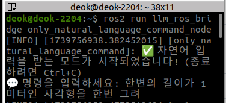

# ROS And LLM 연동 터틀봇 제어
사용자의 자연어 명령을 LLM (Chat GPT)가 이해하고 분석하여 로봇 명령으로 변환, 최종적으로 turtlebot3를 제어 하는 것이 목표이다.

기본 구조는 다음과 같이 묘사할 수 있다.
```
사용자 입력 → ChatGPT (LLM) → ROS 2 노드 → TurtleBot3 제어 (`cmd_vel`)
```
---
구현해야 할 기능들로는 다음을 생각해볼 수 있다.
```
a. 빈 공간에서의 터틀봇 제어 {전진, 후진, 회전, 특정 경로(사각형, 원 등) 그리기}

b. 장애물이 있는 맵을 SLAM 하기 위한 적절한 제어 (장애물이 감지되면 일단 정지하고 새로운 명령 대기)

c. 내비게이션을 활용한 자율주행 {자연어로 좌표 혹은 위치(주방의 테이블) 주면 LLM이 네비게이션에게 정확한 형식으로 좌표전달}
```
**a와 b 기능은 통합하여 하나의 노드로 구현하는 것이 가능하다.** - 
어떤 속도로, 얼마나 회전, 어느정도 시간동안, 어느정도 거리만큼, 장애물 디텍션 되면 정지

**c 기능은 독립된 노드로 구현하는게 유리하다.** - 맵이 있으면 기존 내비게이션의 기능을 활용하는게 훨씬 간편하기 때문 (실시간 장애물 인식 기능 탑재 유무 중요) 

### **본 글에서는 a와 b 기능을 구현한 노드에 대해서 설명하겠다.**


## 1. 노드로 구현된 동작 예시

### 1.1 n도 회전

**input: 좌로 90도 회전해**


### 1.2 연쇄 동작
**input: 앞으로 3미터 갔다가 우로 135도 회전하고 다시 앞으로 3미터 가**


### 1.3 속도 조절
**input: 천천히 가**


### 1.4 직경이 n미터인 원그리기
**input: 직경이 1미터인 원을 그려**


### 1.5 변이 n미터인 정사각형 그리기
**input: 변이 1미터인 정사각형을 그려**

다소 복잡한 시퀀스를 요구하는 명령은 실행되기까지 시간이 소요된다.


### 1.6 장애물 탐지 후 정지
**input: 앞으로 계속 가**

'앞으로 계속 가'라는 명령을 내렸지만 벽을 감지하고 자동적으로 로봇이 멈추는 것을 확인할 수 있다.


---
## 2. 노드에 대한 구체적 설명
위에서 설명한대로 **속도, 방향, 회전, 거리, 시간** 등을 포함한 자연어 명령을 바탕으로 터틀봇을 제어하는 노드를 파이썬 코드로 구현할 수 있다. 

### 전체 파이썬 코드
```bash
import rclpy
from rclpy.node import Node
from sensor_msgs.msg import LaserScan #라이다 활용
from std_msgs.msg import String
from geometry_msgs.msg import Twist
import openai
import os
import json
import time
import re
import threading  # 멀티스레딩 사용

class LLMROSBridge(Node):
    def __init__(self):
        super().__init__('llm_ros_bridge')

        self.client = openai.OpenAI(api_key=os.getenv("OPENAI_API_KEY"))

        if not os.getenv("OPENAI_API_KEY"):
            self.get_logger().error("❌ OpenAI API Key is missing! Set it with 'export OPENAI_API_KEY=your_key_here'")
            return

        self.vel_publisher = self.create_publisher(Twist, 'cmd_vel', 10)
        self.subscription = self.create_subscription(String, 'llm_request', self.llm_callback, 10)

        # 장애물 감지용 LaserScan 구독 추가
        self.scan_subscription = self.create_subscription(LaserScan, '/scan', self.scan_callback, 10)
        
        # 현재 실행 중인 명령을 추적하는 변수
        self.running_command = False  
        self.stop_event = threading.Event()  # 현재 동작을 중단하는 이벤트

        self.obstacle_detected = False  #  장애물 감지 상태 플래그
        self.safety_threshold = 0.3  # 장애물 감지 거리 (0.3m)

        # ✅ 시스템 프롬프트 설정 (토큰 절약 & 정확한 경로 생성)
        self.system_prompt = """
        너는 ROS에서 동작하는 터틀봇을 제어하는 AI야.
        자연어 명령을 받으면, cmd_vel 메시지의 시퀀스를 **JSON 형식**으로 출력해야 해.
        설명은 필요없고 오직 JSON 형식만 출력하도록 부탁해

        다음 규칙을 따르도록 해:
        1. **각도 회전 변환**
           - 기본적으로 `angular.z = ±0.5 rad/s`를 사용한다.
           - 양수 값(`+`)은 **반시계 방향(좌회전)**, 음수 값(`-`)은 **시계 방향(우회전)**을 의미한다.
           -회전 각도를 아래의 공식으로 **라디안** 단위로 변환해야 한다.                
            \[
            \theta_{\text{rad}} = \theta_{\text{deg}} \times \frac{\pi}{180}
            \]                                        


           - 지속 시간은 아래 공식을 사용하여 계산해야 한다.
            \[
            t = \frac{\theta_{\text{rad}}}{\lvert angular.z \rvert}
            \]
           - `angular.z = 0.5 rad/s`일 때,  
           - `90도 좌회전`이면:  
            \[
            t = \frac{1.57}{0.5} = 3.14 \text{ 초}
            \]
           - `135도 우회전`이면:  
            \[
            t = \frac{2.36}{0.5} = 4.71 \text{ 초}
            \]
          JSON 출력 형식 (예제)
          입력: `"시계 방향으로 135도 회전"`
          출력:
          ```json
          [
            {"linear": {"x": 0.0, "y": 0.0, "z": 0.0}, "angular": {"x": 0.0, "y": 0.0, "z": - 0.5}, "duration": 4.71}
          ]
          ```
        2. **거리 이동 변환**     
           - 기본 선속도: 0.5 m/s
           - 이동시간이 주어지면 duration을 그만큼 설정해라
           - 예: "3초 동안 앞으로 가" → {linear.x: 0.5, duration: 3.0}
           - 이동거리가 주어지면 linear.x를 바탕으로 이동 시간을 계산 후 duration을 설정해라
           - 예: "3미터 앞으로 가" → {target distance(미터) 나누기 linear.x: 0.5 = duration: 6.0}
        
        3. **특정한 궤적 (예: 원, 곡선, 하트)**
           - 원을 그릴 때는 반지름과 회전 속도를 고려하여 linear.x와 angular.z를 조합하라.
           - linear.x = 반지름 × angular.z
           - 곡선은 적절한 샘플링을 통해 시퀀스로 분할하라.
           - 하트 같은 복잡한 모양은 궤적 방정식을 따라 계산하라.
        
        4. **자연스럽고 확실한 움직임을 보장**
           - 시퀀스의 경우 각 동작이 명확하게 구분될 수 있도록 사이에 {"linear": {"x": 0.0, "y": 0.0, "z": 0.0}, "angular": {"x": 0.0, "y": 0.0, "z": 0.0}, "duration": 0.5}를 넣어 cmd_vel을 구성하라.
           - 동작의 부드러움을 위해 속도를 적절히 조절하라.
        
        5. **지속되는 동작 처리** 
           -"계속",""지속" 등의 명령어가 포함되면 duration 값을 100 이상으로 줘 
        
        **출력 형식 (예제)**
        입력: "3초 동안 앞으로 갔다가 90도 좌회전해서 다시 2초 동안 앞으로 가"
        출력:
        ```json
        [
          {"linear": {"x": 1.0, "y": 0.0, "z": 0.0}, "angular": {"x": 0.0, "y": 0.0, "z": 0.0}, "duration": 3.0},
          {"linear": {"x": 0.0, "y": 0.0, "z": 0.0}, "angular": {"x": 0.0, "y": 0.0, "z": 0.0}, "duration": 0.5},
          {"linear": {"x": 0.0, "y": 0.0, "z": 0.0}, "angular": {"x": 0.0, "y": 0.0, "z": 0.5}, "duration": 3.14},
          {"linear": {"x": 0.0, "y": 0.0, "z": 0.0}, "angular": {"x": 0.0, "y": 0.0, "z": 0.0}, "duration": 0.5},
          {"linear": {"x": 1.0, "y": 0.0, "z": 0.0}, "angular": {"x": 0.0, "y": 0.0, "z": 0.0}, "duration": 2.0}
        ]
        ```
        """

        self.get_logger().info("✅ LLM ROS Bridge Node Initialized (Immediate command switching enabled)")

    def scan_callback(self, msg):
        """🔹 장애물 감지 함수: 라이다 데이터를 받아 장애물 여부를 판단"""
        min_distance = min(msg.ranges)  # 가장 가까운 장애물 거리 탐색

        if min_distance < self.safety_threshold:
            if not self.obstacle_detected:
                self.obstacle_detected = True
                self.get_logger().warn(f"🛑 장애물 감지! (거리: {min_distance:.2f}m) 로봇을 정지합니다.")
                self.stop_event.set() # 시퀀스 중지
                self.stop_robot() # 로봇 정지

        else:
            self.obstacle_detected = False 

    def llm_callback(self, msg):
        """ 새로운 명령을 받을 때 현재 동작을 중단하고 새로운 동작을 실행 """
        user_input = msg.data.strip()
        self.get_logger().info(f"📩 User Command Received: {user_input}")

        # 실행 중인 동작을 중단하도록 이벤트 설정
        if self.running_command:
            self.get_logger().info("🛑 Stopping current movement for new command...")
            self.stop_event.set()  

        try:
            response = self.client.chat.completions.create(
                model="gpt-4o",
                messages=[
                    {"role": "system", "content": self.system_prompt},
                    {"role": "user", "content": user_input}
                ]
            )

            raw_response = response.choices[0].message.content.strip()
            self.get_logger().info(f"Raw OpenAI Response: {raw_response}")
            cleaned_response = re.sub(r"```json\n(.*?)\n```", r"\1", raw_response, flags=re.DOTALL).strip()
            self.get_logger().info(f"Cleaned JSON Response: {cleaned_response}")

            movement_sequence = json.loads(cleaned_response)

            if not isinstance(movement_sequence, list):
                raise ValueError("Response is not a valid list of movement commands.")

            for step in movement_sequence:
                if not isinstance(step, dict) or "linear" not in step or "angular" not in step or "duration" not in step:
                    raise ValueError(f"Invalid step format: {step}")

            movement_thread = threading.Thread(target=self.execute_movement_sequence, args=(movement_sequence,))
            movement_thread.start()

        except json.JSONDecodeError as e:
            self.get_logger().error(f"❌ JSON Parsing Error: {e}")
        except ValueError as e:
            self.get_logger().error(f"❌ Invalid movement sequence: {e}")
        except Exception as e:
            self.get_logger().error(f"❌ OpenAI API Request Failed: {e}")

    def execute_movement_sequence(self, sequence):
        """cmd_vel 값을 받아서 일정 시간 동안 실행"""
        self.running_command = True
        self.stop_event.clear()

        for step in sequence:
            if self.stop_event.is_set():
                self.get_logger().info("⚠ Command interrupted by new input.")
                break

            if not isinstance(step, dict) or "linear" not in step or "angular" not in step or "duration" not in step:
                self.get_logger().error(f"❌ Invalid movement step: {step}")
                continue

            twist = Twist()
            twist.linear.x = step["linear"].get("x", 0.0)
            twist.linear.y = step["linear"].get("y", 0.0)
            twist.linear.z = step["linear"].get("z", 0.0)
            twist.angular.x = step["angular"].get("x", 0.0)
            twist.angular.y = step["angular"].get("y", 0.0)
            twist.angular.z = step["angular"].get("z", 0.0)

            self.vel_publisher.publish(twist)
            self.get_logger().info(f"🚀 Executing cmd_vel: {twist}")

            time.sleep(step["duration"])

        self.stop_robot()
        self.running_command = False

    def stop_robot(self):
        twist = Twist()
        self.vel_publisher.publish(twist)
        self.get_logger().info("🛑 Stopping robot")

def main(args=None):
    rclpy.init(args=args)
    node = LLMROSBridge()
    rclpy.spin(node)
    rclpy.shutdown()

if __name__ == '__main__':
    main()
```

### 2.1 코드 포인트 별 의도 설명

#### 2.1.1 ai 호출
저장된 open ai키를 불러온다. 
```bash
self.client = openai.OpenAI(api_key=os.getenv("OPENAI_API_KEY"))

        if not os.getenv("OPENAI_API_KEY"):
            self.get_logger().error("❌ OpenAI API Key is missing! Set it with 'export OPENAI_API_KEY=your_key_here'")
            return

```
gpt-4o 모델을 불러와 아래의 시스템 프롬프트와 사용자의 자연어 명령, 'user_input'을 입력한다.
```bash
try:
    response = self.client.chat.completions.create(
        model="gpt-4o",
        messages=[
            {"role": "system", "content": self.system_prompt},
            {"role": "user", "content": user_input}
        ]
    )
```
---

#### 2.1.2 시스템 프롬프트
llm이 사용자의 자연어 명령을 보다 잘 이해할 수 있도록 시스템 프롬프트를 작성하는 것이 좋다. 
```bash
        self.system_prompt = """
        너는 ROS에서 동작하는 터틀봇을 제어하는 AI야.
        자연어 명령을 받으면, cmd_vel 메시지의 시퀀스를 **JSON 형식**으로 출력해야 해.
        설명은 필요없고 오직 JSON 형식만 출력하도록 부탁해
```

회전 제어의 경우 속도에 대한 언급이 없을 때 사용할 각속도를 정의해준다.

주어진 각도를 달성하기 위한 duration 값을 각속도 기반으로 계산하여 발행하도록 요구하였다. 

```bash
        다음 규칙을 따르도록 해:
        1. **각도 회전 변환**
           - 기본적으로 `angular.z = ±0.5 rad/s`를 사용한다.
           - 양수 값(`+`)은 **반시계 방향(좌회전)**, 음수 값(`-`)은 **시계 방향(우회전)**을 의미한다.
           -회전 각도를 아래의 공식으로 **라디안** 단위로 변환해야 한다.                
            \[
            \theta_{\text{rad}} = \theta_{\text{deg}} \times \frac{\pi}{180}
            \]                                        


           - 지속 시간은 아래 공식을 사용하여 계산해야 한다.
            \[
            t = \frac{\theta_{\text{rad}}}{\lvert angular.z \rvert}
            \]
           - `angular.z = 0.5 rad/s`일 때,  
           - `90도 좌회전`이면:  
            \[
            t = \frac{1.57}{0.5} = 3.14 \text{ 초}
            \]
           - `135도 우회전`이면:  
            \[
            t = \frac{2.36}{0.5} = 4.71 \text{ 초}
            \]
          JSON 출력 형식 (예제)
          입력: `"시계 방향으로 135도 회전"`
          출력:
          ```json
          [
            {"linear": {"x": 0.0, "y": 0.0, "z": 0.0}, "angular": {"x": 0.0, "y": 0.0, "z": - 0.5}, "duration": 4.71}
          ]
          ```
```

시퀀스로 cmd_vel을 발행해야 하는 경우 각각의 동작이 명확히 구분되도록 정지동작을 포함시켰다.
```bash
        2. **거리 이동 변환**     
           - 기본 선속도: 0.5 m/s
           - 이동시간이 주어지면 duration을 그만큼 설정해라
           - 예: "3초 동안 앞으로 가" → {linear.x: 0.5, duration: 3.0}
           - 이동거리가 주어지면 linear.x를 바탕으로 이동 시간을 계산 후 duration을 설정해라
           - 예: "3미터 앞으로 가" → {target distance(미터) 나누기 linear.x: 0.5 = duration: 6.0}
        
        3. **특정한 궤적 (예: 원, 곡선, 하트)**
           - 원을 그릴 때는 반지름과 회전 속도를 고려하여 linear.x와 angular.z를 조합하라.
           - linear.x = 반지름 × angular.z
           - 곡선은 적절한 샘플링을 통해 시퀀스로 분할하라.
           - 하트 같은 복잡한 모양은 궤적 방정식을 따라 계산하라.
        
        4. **자연스럽고 확실한 움직임을 보장**
           - 시퀀스의 경우 각 동작이 명확하게 구분될 수 있도록 사이에 {"linear": {"x": 0.0, "y": 0.0, "z": 0.0}, "angular": {"x": 0.0, "y": 0.0, "z": 0.0}, "duration": 0.5}를 넣어 cmd_vel을 구성하라.
           - 동작의 부드러움을 위해 속도를 적절히 조절하라.
        
        5. **지속되는 동작 처리** 
           -"계속",""지속" 등의 명령어가 포함되면 duration 값을 100 이상으로 줘 
        
```
출력 예시를 명확히 주어 보다 정확한 답변을 생성하도록 유도하였다. 
```bash        
        **출력 형식 (예제)**
        입력: "3초 동안 앞으로 갔다가 90도 좌회전해서 다시 2초 동안 앞으로 가"
        출력:
        ```json
        [
          {"linear": {"x": 1.0, "y": 0.0, "z": 0.0}, "angular": {"x": 0.0, "y": 0.0, "z": 0.0}, "duration": 3.0},
          {"linear": {"x": 0.0, "y": 0.0, "z": 0.0}, "angular": {"x": 0.0, "y": 0.0, "z": 0.0}, "duration": 0.5},
          {"linear": {"x": 0.0, "y": 0.0, "z": 0.0}, "angular": {"x": 0.0, "y": 0.0, "z": 0.5}, "duration": 3.14},
          {"linear": {"x": 0.0, "y": 0.0, "z": 0.0}, "angular": {"x": 0.0, "y": 0.0, "z": 0.0}, "duration": 0.5},
          {"linear": {"x": 1.0, "y": 0.0, "z": 0.0}, "angular": {"x": 0.0, "y": 0.0, "z": 0.0}, "duration": 2.0}
        ]
        ```
        """
```

---

#### 2.1. 장애물 감지

터틀봇에 내장된 레이저 센서데이터를 구독하여 장애물을 탐지하는데 사용한다.
```bash
# 장애물 감지용 LaserScan 구독 추가
        self.scan_subscription = self.create_subscription(LaserScan, '/scan', self.scan_callback, 10)
```
장애물 감지 여부를 self.obstacle_detected 값으로 결정하고 0.3m 이내에 들어오면 장애물이 감지된 것으로 간주한다.
```bash
        self.obstacle_detected = False  # 🔹 장애물 감지 상태 플래그
        self.safety_threshold = 0.3  # ✅ 장애물 감지 거리 (0.3m)
```
0.3m 안에 장애물이 탐지되면 self.obstacle_detected 값을 True로 발행하고 현재 진행중이던 시퀀스와 로봇 움직임을 중단한다.
```bash
def scan_callback(self, msg):
        """🔹 장애물 감지 함수: 라이다 데이터를 받아 장애물 여부를 판단"""
        min_distance = min(msg.ranges)  # 가장 가까운 장애물 거리 탐색

        if min_distance < self.safety_threshold:
            if not self.obstacle_detected:
                self.obstacle_detected = True
                self.get_logger().warn(f"🛑 장애물 감지! (거리: {min_distance:.2f}m) 로봇을 정지합니다.")
                self.stop_event.set() # 시퀀스 중지
                self.stop_robot() # 로봇 정지
```

---

## 3. 환경 구현
ROS 2 humble, 가제보 터틀봇 시뮬레이션 등 기본 환경은 갖춰져 있다고 가정한다. 
### 3.1 필요한 패키지 설치
openai 설치
```bash
pip3 install openai
```
colcon 설치 (ROS 2 패키지를 실행할 수 있도록 준비해줌)
```bash
sudo apt update
sudo apt install python3-colcon-common-extensions
```
### 3.2 Open API Key 설정
open ai 사이트에서 키를 발급받은 뒤 사용할 수 있다.
아래의 코드로 발급받은 키를 환경변수로 설정하자.
```bash
echo 'export OPENAI_API_KEY="your_api_key_here"' >> ~/.bashrc
source ~/.bashrc
```

---
### 3.3 ROS 2 워크스페이스
ROS 2의 기본 패키지는(ros-humble-desktop, colcon, gazebo_ros, nav2 등) /opt/ros/humble/에 설치되지만, 

사용자가 직접 만든 패키지 기본 패키지와 충돌 등의 문제를 일으킬 수 있기 때문에 따로 관리되어야 한다. 

따라서 패키지를 관리할 수 있는 경로를 /ros2_ws로 만들어 주자.

---

디렉토리 생성 및 이동
```bash
mkdir -p ~/ros2_ws/src
cd ~/ros2_ws/src
```

유저 패키지 생성 (워크스페이스 디렉토리에서 실행해야 함)
```bash
ros2 pkg create llm_ros_bridge --build-type ament_python --dependencies rclpy std_msgs geometry_msgs
```
---
### 3.3 노드 파일 (llm_ros_node.py) 만들기

파일 생성
```bash
cd ~/ros2_ws/src/llm_ros_bridge/llm_ros_bridge/
touch llm_ros_node.py
chmod +x llm_ros_node.py
```
**파일 생성 후 2.에서 설명하는 코드로 파일 내용을 채워준다.** 

---

### 3.4 노드 실행 준비
setup.py 수정

노드를 만들고 나면 해당 노드를 실행할 수 있게 
setup.py (/ros2_ws/src/llm_ros_bridge/setup.py)파일의 entry_points 부분을 수정해줘야 한다.
```bash
    entry_points={
        'console_scripts': [
            'llm_ros_node = llm_ros_bridge.llm_ros_node:main',  # 실행 가능한 노드 등록
        ],
    },
)
```
실행권한 부여
```bash
chmod +x ~/ros2_ws/src/llm_ros_bridge/llm_ros_bridge/llm_ros_node.py
```
환경변수 설정
```bash
echo "source ~/ros2_ws/install/setup.bash" >> ~/.bashrc
source ~/.bashrc
```
colcon build 실행

```bash
cd ~/ros2_ws
colcon build --packages-select llm_ros_bridge
```
**py 코드를 수정할 때 마다 패키지 빌드는 다시 해줘야 한다.**

---
### 3.5 유저 명령 입력 노드
자연어로 된 유저 명령을 ai에게 전달하기 위한 명령어는 다음과 같다.
```bash
ros2 topic pub --once /llm_request std_msgs/msg/String "{data: 'usser input'}"
```
매번 위의 형식을 유지하여 타이핑하기 번거롭기 때문에 자연어 명령만 타이핑하면 위 명령어 형식에 맞춰서 실행시켜 주는 노드를 파이썬 코드로 구현해보자.


```bash
import rclpy
from rclpy.node import Node
from std_msgs.msg import String

class OnlyNaturalLanguageCommand(Node):  # 클래스 이름도 수정 (선택 사항)
    def __init__(self):
        super().__init__('only_natural_language_command')  # ✅ 노드 이름 수정
        self.publisher = self.create_publisher(String, 'llm_request', 10)

    def run(self):
        """터미널에서 자연어 입력을 받아 LLM 요청을 보내는 함수"""
        self.get_logger().info("✅ 자연어 입력을 받는 모드가 시작되었습니다! (종료하려면 Ctrl+C)")
        try:
            while rclpy.ok():
                # 사용자 입력 받기
                user_input = input("💬 명령을 입력하세요: ").strip()
                if not user_input:
                    continue  # 빈 입력 무시

                # 메시지 발행
                msg = String()
                msg.data = user_input
                self.publisher.publish(msg)
                self.get_logger().info(f"📡 Published: {msg.data}")

        except KeyboardInterrupt:
            self.get_logger().info("🛑 종료합니다.")

def main(args=None):
    rclpy.init(args=args)
    node = OnlyNaturalLanguageCommand()  # ✅ 새로운 클래스명 적용
    node.run()
    node.destroy_node()
    rclpy.shutdown()

if __name__ == '__main__':
    main()
```
코드를 ~/ros2_ws/src/llm_ros_bridge/llm_ros_bridge/에 only_natural_language_command_node.py 이름으로 만든 후 위 과정과 같이 setup.py의 entry points에 추가해주면 아래의 명령어를 터미널에 입력하는 것으로 자연어 명령을 간편하게 입력할 수 있다.

```bash
ros2 run llm_ros_bridge only_natural_language_command_node
```


