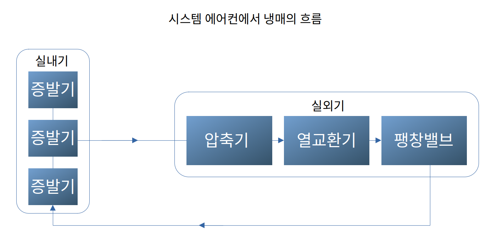

# 시스템 에어컨, Explicit Model Predictive Controller(EMPC)
우리 연구실 석사의 졸업논문을 베이스로 하여 시스템 에어컨의 모델 설계와 EMPC 개념을 공부하는 것을 목표로 한다.

목적: LG전자 에어컨 동작에서 최단시간or최소비용으로 목표온도 도달하는 제어기 설계
- LG전자 에어컨의 임베디드보드(Raspberry PI 정도)에 eMPC를 탑재하여 구동할 수 있는 정도
- 성능개선은 아직 아는 바 없음

**1차년도에서 무엇을 하였는가?**

Multi Zone 이 존재하는 환경에서 사용 용도에 맞게 자율운전.

어떤 용도로 사용되는지 알아야 (인지)

단순히 18 °C 로 맞추면 해결이 되느냐

열부하(e.g. 사람 수, 방 넓이)에 따라 냉방수준 변화

단순 18°C로 설정한다고 해결이 안 된다. ⇒ 부하 예측하려고 모델이 필요하다.

실내기의 토출온도 = 제어입력

첫번째로 정확한 에어컨 구조를 이해해야 한다. (정확히 어떤 밸브, 냉매조절 …)

## 시스템 에어컨 구조...모델
### 2023년 결과보고서에서의 시스템 에어컨 구조

시스템 에어컨은 하나의 실외기가 다수의 실내기를 제어하는 구조  

#### 실외기
- 암축기(Compressor): 실내기에서 흡수한 열을 담고 있는 저온 저압의 냉매를 고온 고압의 상태로 압축하는 역할, 여기서 냉매는 기체 상태
- 열교환기(Condensor): 압축된 고온 고압의 냉매가 외부 공기와 열 교환하여 열을 방출하고 냉매 온도를 낮추는 역할, 이 과정에서 냉매는 기체에서 액체로 응축 
- 팡창벨브(Expansion Valve): 응축된 액체 냉매를 저온 저압으로 팽창시키켜 증발기로 보낼 준비
  
#### 실내기
- 증발기(Evaporator): 팽창밸브에서 나온 저온 저압의 **액체 냉매가 증발하면서 주면 열을 흡수**, 이과정에서 냉매가 다시 기체상태로 변하여 실외기(압축기)로 이동
- 팬: 냉각된 공기를 실내로 순환
- 온도 센서: 실내기 주변의 온도 측정하여 데이터 제공 

### ANN을 통한 에어컨에 의한 온도변화 예측 논문에서의 에어컨 구조
