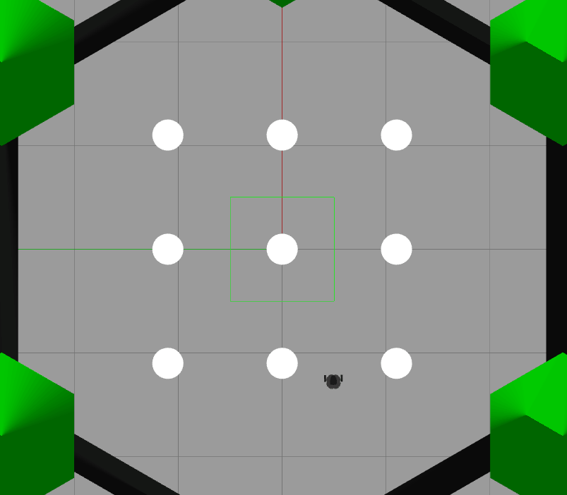

# Turtlebot Simulation 과제
## 1. gazebo를 이용한 가상 터틀봇 시뮬레이션
가상머신 **VMware**를 통해 **Ubuntu 20.04**의 리눅스 환경을 구현하였으며 **ROS Noetic** 버전을 이용하였다.

~/.bashrc에 아래의 코드를 추가하면 매번 터틀봇의 모델을 설정할 필요 없이 항상 burger를 불러올 수 있다.
```bash
export TURTLEBOT3_MODEL=burger
```

**gazebo**란 ROS에서 지원하는 가상 터틀봇 시뮬레이터로 다음의 코드로 실행시킬 수 있다.

```bash
roslaunch turtlebot3_gazebo turtlebot3_world.launch
```
6개의 장애물을 가진 기본 터틀봇 월드와 터틀봇 버거를 확인할 수 있다.


## 2. gmapping을 이용한 SLAM
아래의 코드를 새로운 터미널에 입력하면 gazebo 상의 터틀봇을 키보드로 조작할 수 있다.
```bash
roslaunch turtlebot3_teleop turtlebot3_teleop_key.launch
```
**gmapping**이란 ROS에서 제공하는 **SLAM(Simultaneous Localizatin And Mapping)** 툴이다. 아래의 코드로 실행할 수 있다.
```bash
roslaunch turtlebot3_slam turtlebot3_slam.launch slam_methods:=gmapping
```

### 터틀봇 회전 조작


### 터틀봇 병진 조작 및 SLAM
gazebo상의 터틀봇을 조작하면 gmapping에서의 터틀봇 역시 움직이며 센싱을 통해 맵을 업데이트하는 모습을 확인할 수 있다.


이렇게 SLAM을 통해 맵이 완성되면 아래의 코드를 이용해 저장할 수 있다.
```bash
rosrun map_server map_saver -f ~/map
```

## 3.Navigation을 이용한 자율주행 구현 
ROS 기본 제공 내비게이션을 이용하면 터틀봇의 초기위치와 목적지를 설정하고 자율주행을 구현할 수 있다.
아래의 코드로 내비게이션을 실행하고 아까 저장한 맵을 불러온다.
```bash
roslaunch turtlebot3_navigation turtlebot3_navigation.launch map_file:="/home/deok/map.yaml"
```

### 초기위치 설정
gazebo상의 터틀봇 위치로 네비게이션 상의 터틀봇 위치를 설정해야 한다. 

위치와 방향을 대략적으로 지정해주고 키보드 조작을 통해 터틀봇을 살짝 이동시키면 파티클 필터 알고리즘을 통해 위치가 업데이트된다. 

화면상의 초록색 점은 로봇의 위치에 대한 경우의 수를 대변한다.


### 목적지 설정 및 자율주행
**목적지와 바라볼 방향을 내비게이션 상에서 지정하면 gazebo의 터틀봇이 목적지까지 자율주행하는 걸 확인할 수 있다.**

