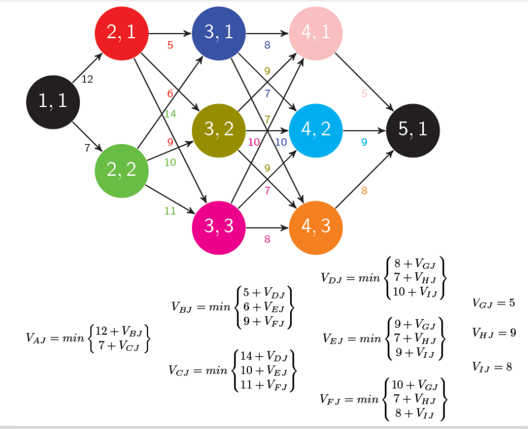
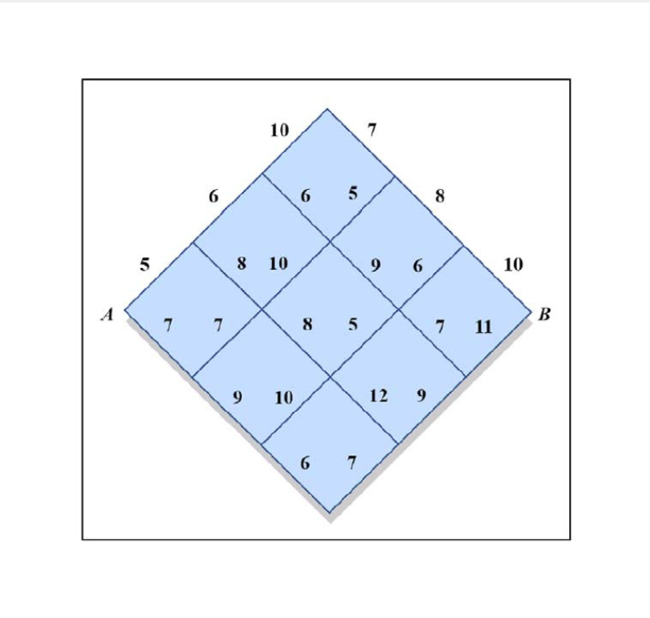

# Dynamic Program

자동제어특상 2주차 1차시의 과제를 해결하는 것을 목표로 한다.

k스테이지 상태 i에서 k +1 스테이지 상태 j까지 가는 코스트를 다음과 같이 표현한다.
$$
d(k, i, k+1, j)
$$
k스테이지, 상태 i에서 목적지까지 가는 최소의 코스트를 다음과 같이 표현한다.
$$
V(k, i)
$$
V를 다음과 같이 쓸 수 있다는 것이 다이내믹 프로그램의 핵심이다. 

다음 스테이지의 상태에서의 목적지까지 최적 비용($V(k+1, j)$을 현재 상태에서 다음 상태까지로의 비용($d(k, i, k+1, j$)과 더 한다.

그 후 가장 작은 값을 선택하면 상태(k, i)에서의 최적 비용($V(k, i)$) 계산이 가능하다.
$$
V(k, i) = min_j( d(k, i, k+1, j) + V(k+1, j))
$$
**위 과정을 역순으로 진행하여 각 포인트에서의 v값을 찾는 과정이 후진 다이내믹 프로그래밍이다.**

**그 다음 출발지에서 시작하여 다음 스테이지의 v값 가운데 최소를 선택해나가면 최적 경로 역시 찾을 수 있다.**

## 과제 에시 1



### answer
```
Minimum Cost from (1,1) to (5,1): 30
Optimal Path: [(1, 1), (2, 1), (3, 1), (4, 1), (5, 1)]
```
사용한 코드
```python
import numpy as np

# 주어진 단계별 상태 개수
num_states = [1, 2, 3, 3, 1]  # [Stage 1, Stage 2, Stage 3, Stage 4, Stage 5]

# 그래프의 비용을 저장하는 딕셔너리 (d(k, i, k+1, j))
costs = {
    (1, 1, 2, 1): 12, (1, 1, 2, 2): 7,
    (2, 1, 3, 1): 5,  (2, 1, 3, 2): 6,  (2, 1, 3, 3): 9,
    (2, 2, 3, 1): 14, (2, 2, 3, 2): 10, (2, 2, 3, 3): 11,
    (3, 1, 4, 1): 8,  (3, 1, 4, 2): 7,  (3, 1, 4, 3): 10,
    (3, 2, 4, 1): 9,  (3, 2, 4, 2): 7,  (3, 2, 4, 3): 9,
    (3, 3, 4, 1): 10, (3, 3, 4, 2): 7,  (3, 3, 4, 3): 8,
    (4, 1, 5, 1): 5,  (4, 2, 5, 1): 9,  (4, 3, 5, 1): 8
}

# 비용 저장 배열 초기화
V = { (5,1): 0 }  # 목적지의 비용은 0으로 설정

# 후진 다이내믹 프로그래밍 수행 (각 스테이지 및 상태에서의 V 구하기)
for k in range(4, 0, -1): # 스테이지 4부터 역순으로 계산
    for i in range(1, num_states[k-1] + 1):
        path_costs = []
        for j in range(1, num_states[k] + 1):
            if (k, i, k+1, j) in costs:
                path_costs.append(costs[(k, i, k+1, j)] + V[(k+1, j)]) #
        V[(k, i)] = min(path_costs) if path_costs else float('inf')

# 최소 비용 출력
print("Minimum Cost from (1,1) to (5,1):", V[(1,1)])

# 최적 경로 추적
path = [(1,1)]
current_stage, current_state = 1, 1
for k in range(1, 5):
    next_states = range(1, num_states[k] + 1)
    next_state = min(next_states, key=lambda j: costs.get((k, current_state, k+1, j), float('inf')) + V.get((k+1, j), float('inf'))) #이동 비용 코스트 다음 상태에서 목표까지의 최소 비용을 더하여 최적 경로 선택
    path.append((k+1, next_state))
    current_state = next_state

print("Optimal Path:", path)
```

---
## 2. 과제 예시 2


### answer
```
Minimum Cost from A to B: 40
Optimal Path: [(1, 1), (2, 1), (3, 1), (4, 2), (5, 1), (6, 1), (7, 1)]
```

### 2.1 이슈 및 해결방법

첫번째 예시에서는 (k, i)에서 다음 스테이지의 모든 상태로 갈 수 있었다.

하지만 본 과제에서는 **각 (k, i)마다 이동할 수 있는 (k+1, j)의 상태가 다 다름을 정확히 반영하는 것이 핵심이다.**

---
A를 (1,1), B를 (7,1)로 보고 stage, state 모델로 표현한 후 각 경로에 대한 코스트 값을 딕셔너리 형태로 모두 적어주었다.
```python
costs = {
    (1, 1, 2, 1): 5, (1, 1, 2, 2): 7,
    (2, 1, 3, 1): 6,  (2, 1, 3, 2): 8,  (2, 2, 3, 2): 7,
    (2, 2, 3, 3): 9, (3, 1, 4, 1): 10, (3, 1, 4, 2): 6,
    (3, 2, 4, 2): 10,  (3, 2, 4, 3): 8,  (3, 3, 4, 3): 10,
    (3, 3, 4, 4): 6,  (4, 1, 5, 1): 7,  (4, 2, 5, 1): 5,
    (4, 2, 5, 2): 9, (4, 3, 5, 2): 5,  (4, 3, 5, 3): 12,
    (4, 4, 5, 3): 7,  (5, 1, 6, 1): 8,  (5, 2, 6, 1): 6,
    (5, 2, 6, 2): 7, (5, 3, 6, 2): 9, (6, 1, 7, 1): 10,
    (6, 2, 7, 1): 11
}
```

```python
next_states = {}  # 다음 스테이지에서 갈 수 있는 상태를 저장할 딕셔너리

for (k, i, k1, j) in costs.keys():  # costs 딕셔너리의 모든 키 (k,i,k1,j)를 순회
    if (k, i) not in next_states:  # 현재 (k, i) 상태가 next_states에 없다면 초기화
        next_states[(k, i)] = []
    next_states[(k, i)].append((k1, j))  # 현재 (k, i)에서 갈 수 있는 (k1, j) 추가

print(next_states)
```
위 코드로 next_stages 변수를 정의하면 다음과 같이 출력을 얻을 수 있다.
```
{(1, 1): [(2, 1), (2, 2)], (2, 1): [(3, 1), (3, 2)], (2, 2): [(3, 2), (3, 3)], (3, 1): [(4, 1), (4, 2)], (3, 2): [(4, 2), (4, 3)], (3, 3): [(4, 3), (4, 4)], (4, 1): [(5, 1)], (4, 2): [(5, 1), (5, 2)], (4, 3): [(5, 2), (5, 3)], (4, 4): [(5, 3)], (5, 1): [(6, 1)], (5, 2): [(6, 1), (6, 2)], (5, 3): [(6, 2)], (6, 1): [(7, 1)], (6, 2): [(7, 1)]}
```
**즉 특정 (k, i)에 대해 가능한 다음 경로를 next_states[(k, i)]에서 찾게 하여 문제를 해결하였다.**

완전한 코드

```PYTHOn
import numpy as np

# 스테이지별 상태 개수
num_states = [1, 2, 3, 4, 3, 2, 1]  # 각 스테이지별 상태 개수

# 각 스테이지에서 이동 가능한 경로 정의
costs = {
    (1, 1, 2, 1): 5, (1, 1, 2, 2): 7,
    (2, 1, 3, 1): 6,  (2, 1, 3, 2): 8,  (2, 2, 3, 2): 7,
    (2, 2, 3, 3): 9, (3, 1, 4, 1): 10, (3, 1, 4, 2): 6,
    (3, 2, 4, 2): 10,  (3, 2, 4, 3): 8,  (3, 3, 4, 3): 10,
    (3, 3, 4, 4): 6,  (4, 1, 5, 1): 7,  (4, 2, 5, 1): 5,
    (4, 2, 5, 2): 9, (4, 3, 5, 2): 5,  (4, 3, 5, 3): 12,
    (4, 4, 5, 3): 7,  (5, 1, 6, 1): 8,  (5, 2, 6, 1): 6,
    (5, 2, 6, 2): 7, (5, 3, 6, 2): 9, (6, 1, 7, 1): 10,
    (6, 2, 7, 1): 11
}

# 이동 가능 경로 자동 생성
next_states = {}
for (k, i, k1, j) in costs.keys():
    if (k, i) not in next_states:
        next_states[(k, i)] = []
    next_states[(k, i)].append((k1, j))

# 비용 저장 배열 초기화
V = { (7,1): 0 }  # 목적지의 비용은 0으로 설정

# 후진 다이내믹 프로그래밍 수행
for k in range(6, 0, -1):
    for i in range(1, num_states[k-1] + 1):
        path_costs = []
        if (k, i) in next_states:
            for (k1, j) in next_states[(k, i)]: 
                path_costs.append(costs[(k, i, k1, j)] + V[(k1, j)])
        V[(k, i)] = min(path_costs) if path_costs else float('inf')

# 최소 비용 출력
print("Minimum Cost from A to B:", V[(1,1)])

# 최적 경로 추적
path = [(1,1)]
current_stage, current_state = 1, 1
for k in range(1, 7):
    if (k, current_state) in next_states:
        next_state = min(next_states[(k, current_state)], key=lambda j: costs.get((k, current_state, j[0], j[1]), float('inf')) + V.get(j, float('inf')))
        path.append(next_state)
        current_stage, current_state = next_state

print("Optimal Path:", path)
```